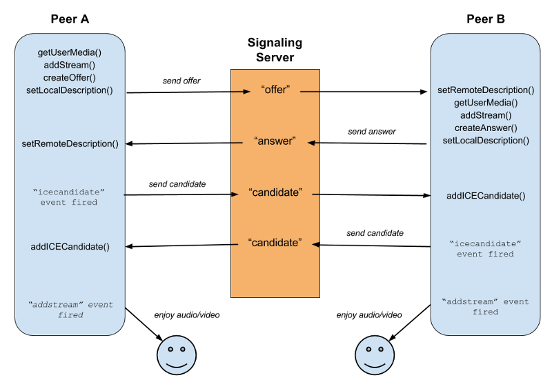

# WebRTC


## 1. 웹소켓 연결, join 메세지 전송(Peer A)
```typescript
function VideoChat() {

    ...

    useEffect(() => {

        ...

        // 스프링 서버와 stomp 연결하는 함수
        const handleStompConnection = () => {
            const ws = new SockJS("http://localhost:8080/stomp");
            stomp.current = Stomp.over(ws);
            stomp.current.connect({}, () => {
                stomp.current?.subscribe(`/exchange/chat.exchange/room.${roomKey}`, (message) => {
                    const json = JSON.parse(message.body);
                    if(json.type === "message") {
                        setReceivedMsg(receivedMsg => [...receivedMsg, `${json.nickname} : ${json.msg}`]);
                    } else if(json.type === "join") {
                        if(json.from !== from) {
                            makeOffer(json.from);
                        }
                    } else if(json.type === "offer") {
                        if(from === json.target) {
                            makeAnswer(json.from, json.sdp);
                        }
                    } else if(json.type === "answer") {
                        if(from === json.target) {
                            myPeerConnections.get(json.from)?.setRemoteDescription(json.sdp);
                        }
                    } else if(json.type === "ice") {
                        if(from === json.target) {
                            myPeerConnections.get(json.from)?.addIceCandidate(json.iceCandidate);
                        }
                    } else if(json.type === "leave") {
                        const myPeerConnection = myPeerConnections.get(json.from);
                        if(myPeerConnection) {
                            disconnect(myPeerConnection);
                        }
                        setRemoteStreams(remoteStreams => {
                            const updated = new Map<string, MediaStream>(remoteStreams);
                            updated.delete(json.streamId);
                            return updated;
                        })
                    }
                });
            });
        }

        const joinRoom = async () => {
            try{
                // 스프링 서버와 stomp 연결
                handleStompConnection();
                if(!videoEl.current) {
                    return;
                }
                // local media stream을 얻는다.
                localStream.current = await navigator.mediaDevices.getUserMedia({
                    audio: true,
                    video: {
                        facingMode: "user"
                    },
                });
                // local media stream을 video element에 넣어 나의 화면을 웹브라우저에 표시
                videoEl.current.srcObject = localStream.current;
                // 웹소켓을 연결한 후 join 메세지를 해당 room에 있는 모든 유저에게 보낸다.
                stomp.current?.send(`/chat/room.${roomKey}`, {}, JSON.stringify({type: "join", from, nickname}));
            } catch(err: any) {
                console.log(err);
            }
        }

        // 페이지에 들어가면 joinRoom() 실행
        joinRoom();

        ...

    })
}
```
## 2. offer 전송(Peer B)
```typescript
// 다른 유저의 join 메세지를 받으면 makeOffer 함수를 실행한다.
const makeOffer = async (target: string) => {
    // 새로운 RTCPeerConnection 생성
    const newPeerConnection = createPeerConnection(target);
    if(!newPeerConnection) {
        return;
    }
    newPeerConnection.onnegotiationneeded = async () => {
        // offer 생성 후 local description으로 등록하고 offer를 다른 사용자에게 보낸다.
        const offer = await newPeerConnection.createOffer();
        await newPeerConnection.setLocalDescription(offer);
        stomp.current?.send(`/chat/room.${roomKey}`, {}, JSON.stringify({type: "offer", from, target, sdp: newPeerConnection.localDescription})); 
    }
}
```
```typescript
const createPeerConnection = (target: string) => {
    if(!localStream.current) {
        console.log("no media");
        return null;
    }
    const newPeerConnection = new RTCPeerConnection(peerConnectionConfig);
    // 여러 유저와 연결하기 위해서 RTCPeerConnection을 Map으로 관리한다.
    myPeerConnections.set(target, newPeerConnection);
    // iceCandidate 이벤트 등록
    newPeerConnection.onicecandidate = (data) => {
        stomp.current?.send(`/chat/room.${roomKey}`, {}, JSON.stringify({type: "ice", from, target, iceCandidate: data.candidate}));
    }
    // track 이벤트 등록(다른 사용자로부터 media stream을 받았을 때)
    newPeerConnection.ontrack = handleTrack;
    // 생성한 RTCPeerConnection에 보낼 track(동영상, 오디오)을 추가한다.
    localStream.current.getTracks().forEach(track => {
        if(!localStream.current) {
            console.log("no media");
            return;
        }
        newPeerConnection.addTrack(track, localStream.current);
    });
    return newPeerConnection;
}
```
```typescript
// webRTC 연결 후 다른 사용자로부터 받은 media stream을 관리한다.
const handleTrack = (data: RTCTrackEvent) => {
    setRemoteStreams(remoteStreams => {
        const updated = new Map<string, MediaStream>(remoteStreams);
        updated.set(data.streams[0].id, data.streams[0]);
        return updated;
    });
}
```
## 3. answer 전송(Peer A)
```typescript
// offer 메세지 수신시 동작
const makeAnswer = async (target: string, receivedOffer: RTCSessionDescriptionInit) => {
    const newPeerConnection = createPeerConnection(target);
    if(!newPeerConnection) {
        return;
    }
    // 다른 사용자로부터 받은 offer을 remote description으로 등록한다.
    await newPeerConnection.setRemoteDescription(receivedOffer);
    // answer를 생성하고 생성한 answer를 local description으로 등록 후 offer를 보낸 사용자에게 answer를 보낸다.
    const answer = await newPeerConnection.createAnswer();
    await newPeerConnection.setLocalDescription(answer);
    stomp.current?.send(`/chat/room.${roomKey}`, {}, JSON.stringify({type: "answer", from, target, sdp: newPeerConnection.localDescription}));
}
```
```typescript
const createPeerConnection = (target: string) => {
    if(!localStream.current) {
        console.log("no media");
        return null;
    }
    const newPeerConnection = new RTCPeerConnection(peerConnectionConfig);
    // 여러 유저와 연결하기 위해서 RTCPeerConnection을 Map으로 관리한다.
    myPeerConnections.set(target, newPeerConnection);
    // iceCandidate 이벤트 등록
    newPeerConnection.onicecandidate = (data) => {
        stomp.current?.send(`/chat/room.${roomKey}`, {}, JSON.stringify({type: "ice", from, target, iceCandidate: data.candidate}));
    }
    // track 이벤트 등록(다른 사용자로부터 media stream을 받았을 때)
    newPeerConnection.ontrack = handleTrack;
    // 생성한 RTCPeerConnection에 보낼 track(동영상, 오디오)을 추가한다.
    localStream.current.getTracks().forEach(track => {
        if(!localStream.current) {
            console.log("no media");
            return;
        }
        newPeerConnection.addTrack(track, localStream.current);
    });
    return newPeerConnection;
}
```
## 4. remote description 설정(Peer B)
```typescript
stomp.current?.subscribe(`/exchange/chat.exchange/room.${roomKey}`, (message) => {
    
    ...

    else if(json.type === "answer") {
        if(from === json.target) {
            // Peer A가 전송한 answer를 remote description으로 설정
            myPeerConnections.get(json.from)?.setRemoteDescription(json.sdp);
        }
    }

    ...


});
```
## 5. ice candidate 설정
```typescript
stomp.current?.subscribe(`/exchange/chat.exchange/room.${roomKey}`, (message) => {
    
    ...

    else if(json.type === "ice") {
        if(from === json.target) {
            // 피어 간 통신이 가능한 프로토콜을 주고받는다.
            myPeerConnections.get(json.from)?.addIceCandidate(json.iceCandidate);
        }
    }

    ...


});
```