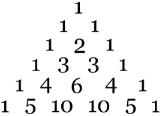
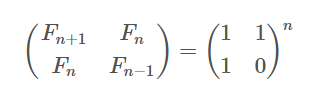

# 코딩테스트
## LIS 알고리즘
```c++
// vector<int> v 에는 최장 증가 부분 수열을 구할 배열 값이 들어있다.
// vector<int> length의 length[i] 에는 v의 인덱스 i에서 끝나는 최장 증가 부분 수열의 길이가 들어간다.
// 처음 vector<int> length는 전부 1로 초기화 되어있다.
for(int i=1; i<v.size(); i++){
    for(int j=0; j<i; j++){
        if(v[j] < v[i]){
            if(length[j] + 1 > length[i]){
                length[i] = length[j] + 1;
            }
        }
    }
}
```
* LIS 알고리즘은 DP를 이용한 알고리즘이다.
* 첫 번째 반복문에서는 인덱스 i에서 끝나는 최장 증가 부분 수열을 구하기위해 1부터 v.size()까지 반복한다.(인덱스 1부터 인덱스 v.size()-1 까지 각각의 인덱스에서 끝나는 최장 증가 부분 수열을 모두 구한다.)
* 두 번째 반복문에서는 만약 v[j] 값이 v[i] 값보다 크다면 `{인덱스 j에서 끝나는 최장 증가 부분 수열, v[i]}` 도 증가하는 부분 수열이므로 그 중에서 가장 긴 수열을 구하기 위해 length[j] + 1 > length[i] 인 경우에만 length[i] = length[j] + 1 를 한다.
## LIS 알고리즘 with 이분탐색
```c++
#include <bits/stdc++.h>

using namespace std;

int main() {    

    int n, num, left = 0, right = 1, result = (left+right)/2;
    cin >> n;
    vector<int> v(1, 0); // 인덱스는 부분 수열의 길이, 값은 해당 길이의 부분 수열중 마지막 값이 가장 작은 수열의 마지막 값
    for(int i=0; i<n; i++) {
        cin >> num;
        while(right-left > 1) {
            // v[result] < num 이면 num으로 끝나는 부분수열은 최소한 result+1이다.
            if(v[result] < num) {
                left = result;

            // v[result] >= num 이면 num으로 끝나는 부분수열은 최대 result이다.
            } else {
                right = result;
            }
            result = (left+right)/2;
        }
        // v[result] < num 이면 증가하는 수열이다.
        if(v[result] < num) {
            // result+1 == v.size()-1이면 현재 까지의 최장 부분 수열보다 길이가 1 더 커진다.
            if(v.size()-1 < result+1) {
                v.push_back(num);

            //v[result+1] > num 이면 길이가 result+1인 부분 수열중 마지막 값이 가장 작은 부분 수열의 마지막 값은 num이 된다.
            } else if(v[result+1] > num) {
                v[result+1] = num;
            }
        }
        left = 0;
        right = v.size();
        result = (left+right)/2;
    }
    cout << v.size()-1;
}
```
* 동적 할당으로 풀되 저장하는 값은 해당 인덱스로 끝나는 부분 수열의 최장 길이가 아니라, 인덱스는 부분 수열의 길이이고, 값은 해당 길이의 부분 수열중 마지막 값이 가장 작은 수열의 마지막 값을 저장한다.
## 유클리드 알고리즘(최대 공약수)
```c++
int a, b, n;
cin >> a >> b;
a = max(a, b);
b = min(a, b);
while(b!=0){
    n = a%b;
    a = b;
    b = n;
}
cout << a;
```
`78696 ＝ 19332×4 ＋ 1368`
`19332 ＝ 1368×14 ＋ 180`
`1368 ＝ 180×7 ＋ 108`
`180 ＝ 108×1 ＋ 72`
`108 ＝ 72×1 ＋ 36`
`72 ＝ 36×2 ＋ 0`
1. 19332가 최대 공약수가 되기 위해서는 78696을 19332로 나눈 나머지가 0이어야 하지만 0이 아니기 때문에 19332는 최대공약수가 아니다.
2. 19332가 1368로 나누어 떨어지면 1368은 78696과 19332의 최대 공약수이다. 왜냐하면 78696의 19332*4가 1368로 나누어떨어질 테고, 1368도 1368로 나누어떨어지기 때문이다.
3. 이 과정을 계속 반복한다.
## 배낭 문제 알고리즘
```c++
int n, k;
cin >> n >> k;
int dp[n+1][k+1];
int w, v;
memset(dp[0], 0, (k+1)*sizeof(int));
for(int i=0; i<n+1; i++) {
    dp[i][0] = 0;
}
// i : i번째 물건
for(int i=1; i<=n; i++) {
    cin >> w >> v;
    // j : 무게
    // dp[i][j] : 첫 번째 물건부터 i 번째 물건 중에서 골라서 무게 j를 만들 때 가장 높은 value가 dp[i][j] 에 들어감
    for(int j=1; j<=k; j++) {
        //i 번째 물건을 가방에 넣는 경우
        if(j>=w && dp[i-1][j] < dp[i-1][j-w]+v) {
            dp[i][j] = dp[i-1][j-w]+v;
        //i 번째  물건을 가방에 넣지 않는 경우
        } else {
            dp[i][j] = dp[i-1][j];
        }
    }
}
cout << dp[n][k];
```
* 첫 번째 물건부터 시작하여 n번째 물건까지 반복문을 돌면서 i 번째 물건을 넣은 경우와 넣지 않은 경우 중에서 value가 높은 값은 dp에 넣는다. 이 때 dp의 크기는 k보다 큰 경우는 고려할 필요가 없기 때문에 k+1이 된다.
* 만약 가방의 크기 k가 모든 물건의 value 합보다 클 경우에는 dp를 모든 물건의 value 합을 기준으로 할 수도 있다. 단, 이렇게 되면 로직이 좀 더 복잡해지긴 한다.(만약 가방 무게를 k이상으로 만드는 경우에는 이 경우가 더 로직이 단순하다.)
## 파스칼 삼각형


* 조합 <sub>n</sub>C<sub>k</sub> 를 구할 때 사용함
## LCS 알고리즘
```c++
string s1, s2;
int len = 0;
cin >> s1 >> s2;
vector<vector<int>> seq(s1.size()+1, vector<int>(s2.size()+1, 0));
for(int i=1; i<seq.size(); i++) {
    for(int j=1; j<seq[i].size(); j++) {
        if(s2[j-1] == s1[i-1]) {
            seq[i][j] = seq[i-1][j-1] + 1;
        }else {
            seq[i][j] = max(seq[i][j-1], seq[i-1][j]);
        }
        if(seq[i][j] > len) {
            len = seq[i][j];
        }
    }
}
```
* LCS 알고리즘은 최장 공통 부분 수열을 구하는 알고리즘이다.
* LCS 알고리즘은 문자열을 2차원 배열로 배치하고 2중 for문을 통해 글자를 비교하며 dp를 통해 문제를 푼다.
* seq[i][j]값은 s1[i-1]과 s2[j-1]이 같을 때는 seq[i-1][j-1]+1이 seq[i][j] 값이 되고, s1[i-1]과 s2[j-1]이 다를 때는 seq[i][j-1]과 seq[i-1][j] 중 큰 값이 seq[i][j] 값이 된다.
## 다익스트라 알고리즘
```c++
struct cmp {
    bool operator()(pair<int, int> a, pair<int, int> b) {
        return a.second > b.second;
    }
};

int main() {
    
    cin.tie(NULL);
    cout.tie(NULL);
    ios::sync_with_stdio(false);

    int v, e, s, a, b, d, minimum = 0;
    cin >> v >> e >> s;
    long long dist[v];
    fill(dist, dist+v, 6000000000);
    vector<vector<pair<int, int>>> node(v, vector<pair<int, int>>());
    priority_queue<pair<int, int>, vector<pair<int, int>>, cmp> pq;
    pq.push(make_pair(s-1, 0));
    for(int i=0; i<e; i++) {
        cin >> a >> b >> d;
        node[a-1].push_back(make_pair(b-1, d));
    }
    while(!pq.empty()) {
        int cur = pq.top().first;
        int len = pq.top().second;
        if(len <= dist[cur]) {
            dist[cur] = len;
            for(int i=0; i<node[cur].size(); i++) {
                if(dist[node[cur][i].first] > dist[cur]+node[cur][i].second) {
                    dist[node[cur][i].first] = dist[cur]+node[cur][i].second;
                    pq.push(make_pair(node[cur][i].first, dist[node[cur][i].first]));
                }
            }
        }
        pq.pop();
    }
}
```
* 우선순위 큐를 사용할 때는 같은 노드를 여러번 갱신한다는 것을 유념하자
###  s1[i-1]과 s2[j-1]이 같을 때


seq[3][2]의 값은 "ACA"와 "CA"의 최장 공통 부분 수열의 길이이다. 그리고 seq[3-1][2-1]은 "AC"와 "C"의 최장 공통 부분 수열의 길이이고 이 길이는 1이다. 이 문자열을 s<sub>n</sub>이라 하자. 그리고 s<sub>1</sub> 에서 s<sub>n-1</sub> 까지 공통 부분 수열이 있다고 하자. s<sub>n</sub>가 최장 길이이기 때문에 s<sub>1</sub> 에서 s<sub>n-1</sub> 까지의 모든 문자열은 s<sub>n</sub>의 길이보다 작거나 같을 것이다. "AC"와 "C"에 각각 문자 'A'를 붙여 "ACA"와 "CA"를 만들자. "AC"와 "C"에 'A'라는 같은 문자를 더했기 때문에 s<sub>1</sub> 에서 s<sub>n</sub> 까지의 모든 부분 수열 또한 마지막에 'A'라는 문자가 더해질 것이고, 따라서 길이도 전부 1 증가할 것이다. 그러므로 'A'라는 같은 문자를 더했다 하더라도 s<sub>n</sub>이 여전히 최장 공통 부분 수열일 것이고 이 길이는 seq[3-1][2-1]+1이 될 것이다.
###  s1[i-1]과 s2[j-1]이 다를 때


seq[3][3]의 값은 "ACAY"와 "CAPC"의 최장 공통 부분 수열의 길이이다. 그리고 seq[3-1][3]은 "ACAY"와 "CAP"의 최장 공통 부분 수열의 길이이고 이 길이는 2이다. 또 seq[3][3-1]은 "ACA"와 "CAPC"의 최장 공통 부분 수열의 길이이고 이 길이는 2이다.

"ACAY"와 "CAP"에서 "CAP"에 C를 붙여 "ACAY"와 "CAPC"로 만들었을 때 최장 공통 부분 수열의 길이가 1 증가한다고 가정하자. 이 때 "ACAY"와 "CAP"의 최장 공통 부분 수열은 'C'를 붙임으로써 길이가 증가했기 때문에 "CAPC"의 마지막 문자인 'C'를 반드시 포함한다. 따라서 이 문자열은 "ACA"와 "CAPC"의 공통 부분 수열이기도 하다. 왜냐하면 해당 문자열은 'C'로 끝나는 문자열이므로 "ACAY"와 "CAPC" 에서 "ACAY"의 마지막 문자인 'Y'를 포함하지 않기 때문이다. 따라서 "ACAY"와 "CAP"에서 "CAP"에 C를 붙여 "ACAY"와 "CAPC"로 만들었을 때 길이가 1 증가한 수열의 길이는 "ACA"와 "CAPC"의 최장 공통 부분 수열의 길이보다 작거나 같다. 그러므로 "ACAY"와 "CAPC"의 최장 공통 부분 수열은 "ACA"와 "CAPC"의 최장 공통 부분 수열이기 때문에 seq[3][3]은 seq[3][3-1]과 같다. "ACA"에 'Y'를 붙였을 때 최장 공통 부분 수열의 길이가 1 증가하는 경우도 이와 같은 방식으로 구할 수 있다. 둘 다 증가하는 경우는 당연히 존재하지 않는다.(증가한 문자열이 반대편의 공통 부분 수열이므로 반대편의 최장 공통 부분 수열의 길이보다 작거나 같아야 하는데 둘 다 증가하면 성립하지 않음)

만약 "ACAY"와 "CAP"에서 "CAP"에 C를 붙여 "ACAY"와 "CAPC"로 만들었을 때, 그리고 "ACA"와 "CAPC"에서 "ACA"에 'Y'를 붙여 "ACAY"와 "CAPC"로 만들었을 때 둘 다 최장 공통 부분 수열의 길이가 증가하지 않는 경우에는 "ACAY"와 "CAPC"의 최장 공통 부분 수열은 "ACAY"와 "CAPC"의 공통 부분 수열인 "ACAY"와 "CAP"와 "ACA"와 "CAPC"의 최장 공통 부분 수열 중 더 길이가 긴 수열이 "ACAY"와 "CAPC"의 최장 공통 부분 수열이 될 것이다.

따라서 seq[i][j] =  max(seq[i][j-1], seq[i-1][j])가 된다.
## 피보나치 수 구하기


* n번째 피보나치 수는 행렬을 이용해 O(logN)시간 안에 구할 수 있다.
## 구현
### 각 자리수의 값 구하기
```c++
int n = 23485;
for(int i=1; i=<n; i*=10){
    cout << n / i % 10 << " ";
}
```
* `5 8 4 3 2`출력 됨
### 위, 아래, 좌, 우 이동
```c++
int dx[] = {0, 0, -1, 1};
int dy[] = {1, -1, 0, 0};
```
* 이런식으로 방향을 배열로 정의해두면 편하다.
* 0 -> 아래, 1 -> 위, 2 -> 좌, 3 -> 우
### 조합
```c++
#include <bits/stdc++.h>

using namespace std;

int n, m;

//배열 num의 시작지점(s)에서 끝까지 중 r개만큼을 선택
void select(int s, int r, int *num, string p){
    if(r == 0){
        cout << p;
        return;
    }
    //i는 무조건 선택, i를 선택했기 때문에 r-1개 만큼 더 선택해야 하므로 i는 n-(r-1)까지만 순환 가능
    for(int i=s; i<n-r+1; i++){
        p[(m-r)*2] = num[i] + '0';
        select(i+1, r-1, num, p);        
    }
}

int main(){

    cin.tie(NULL);
    cout.tie(NULL);
    ios::sync_with_stdio(false);

    cin >> n >> m;
    int num[n];
    string p;
    for(int i=0; i<m; i++){
        p.append("  ");
    }
    p.append("\n");
    for(int i=0; i<n; i++){
        num[i] = i+1;
    }
    select(0, m, num, p);
}
```
* 조합은 재귀함수를 통해서 얻을 수 있다.
### 번갈아가면서 사용하기
```c++
int n, k;
cin >> n >> k;
int dp[2][k+1];
int w, v;
memset(dp[0], 0, (k+1)*sizeof(int));
for(int i=1; i<=n; i++) {
    cin >> w >> v;
    for(int j=0; j<=k; j++) {
        if(j < w) {
            dp[i%2][j] = dp[(i+1)%2][j];
        } else {
            if(dp[(i+1)%2][j] < dp[(i+1)%2][j-w]+v) {
                dp[i%2][j] = dp[(i+1)%2][j-w]+v;
            } else {
                dp[i%2][j] = dp[(i+1)%2][j];
            }
        }
    }
}
if(n%2 == 0) {
    cout << dp[0][k];
} else {
    cout << dp[1][k];
}
```
* %를 사용하여 2개의 자료구조를 번갈아 가면서 사용할 수 있다.
### 잡다
* `cin.eof()` : 입력의 종료 조건이 없을 때 파일 끝까지 입력받기 위해 쓰자
* `cin.tie(NULL)`, `cout.tie(NULL)`, `ios::sync_with_stdio(false)` : 출력버퍼에 저장했다가 한번에 출력할 때, 입출력 속도가 빠를 필요가 있을 때 사용하자. 단, 이걸 사용하려면 `endl` 대신에 `\n`를 사용하자
* `cout.precision(5)`, `cout << fixed` : 소수점 출력 자리수 정할 때, `cout << fixed` 사용안하면 소수점 자리수를 `cout.precision(5)`로 5로 정했다 해도 소수점 아래자리수가 0이면 출력 안함 예를 들면 0.33400 -> 0.334까지만 출력
* 규칙적인 패턴을 가진 문양과 같은 것에 대한 문제는 수열을 가지고 쉽게 풀 수 도 있다.
* 일반적인 직교 좌표계는 이차원 배열과 비교해서 x방향은 같지만 y방향은 반대이다.
* 반올림 : `round(doube)`, 올림 :  `ceil(double)`, 내림 : `floor(double)`. 소수점 첫째자리에서 반올림, 올림, 내림되며 반환값을 double이다. 만약 소수점 첫째자리가 아니라 다른 자리수에서 반올림, 올림, 내림을 하고 싶으면 10<sup>n</sup> 만큼 곱하거나 나눈 뒤 함수를 적용한 후 다시 반대로 나누거나 곱하면 된다.
* memset() 함수는 char 타입을 초기화하거나 숫자 타입을 0으로 초기화 하는데는 유용하게 사용할 수 있지만 숫자 타입을 0이 아닌 타입으로 변환할 수 없다. 왜냐하면 memset()은 초기화 시 1바이트 단위로 초기화 하는데 숫자 타입은 최소 2바이트 이상이기 때문이다. 따라서 C++의 경우에는(C에는 없음) fill()함수를 사용하는 것이 좋다.
* num1과 num2의 최소 공배수는 num1과 num2의 최대공약수를 gcf라 했을 때 num1/gcf\*num2 혹은 num2/gcf\*num1이다.
* O(N)의 반복으로도 시간상 안되는 경우에는 거의 무조건 O(logN)이니깐 O(logN)으로 해결하는 방법으로 고려하자(이분탐색, 반복을 i++이 아니라 i*=2 등)
* 이분탐색을 할 때는 
  + 알고리즘을 써서 해답답을 구한다 -> X
  + 답이 어떤 특정 값(해답이 될 수 있는 최소값과 최대값의 중앙값)이라 가정하고 알고리즘을 써서 해당 값이 조건에 부합하는지 검증한다 그리고 조건에 부합하면 해답의 최소값과 해당 값의 중앙값도 조건에 부합하는지(혹은 해답의 최대값과 해당 값의 중앙값), 조건에 부합하면 해답의 최대값과 해당 값의 중앙값도 조건에 부합하는지(혹은 해답의 최소값과 해당 값의 중앙값)를 계속해서 검증한다. -> O