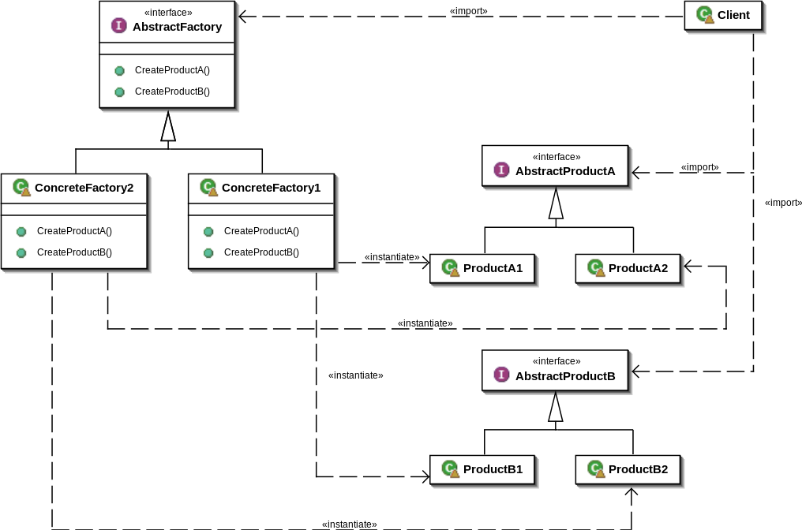

# 추상 팩토리 패턴


```java
public abstract class Item {

    //생성해야할 객체 집합
    private Element element;
    private Member member;

    public setElement(Element element){
        this.element = element;
    }

    public setMember(Member member){
        this.member = member;
    }

    public abstract void use();
}
```
```java
public class Computer extends Item {

    @Override
    public void use(){
        System.out.println("use computer");
    }
}
```
```java
public class Cleaner extends Item {

    @Override
    public void use(){
        System.out.println("use cleaner");
    }
}
```
```java
public interface ItemCreator {

    default Item create() {
        before();
        Item item = createItem();
        after();
        return item;
    }

    private void before(){ 
        System.out.println("Before Logic");
    }

    private void after(){
        System.out.println("After Logic");
    }

    Item createItem();
}
```
```java
// client
public class ComputerCreator implements ItemCreator {

    private ElementFactory elementFactory;

    public ComputerCreator(ElementFactory elementFactory){
        this.elementFactory = elementFactory;
    }

    @Override
    public Item createItem() {
        Item item = new Computer();
        item.setElement(elementFactory.createElement());
        item.setMember(elementFactory.createMember());
        return item;
    }
}
```
```java
// abstract factory
public interface ElementFactory {
    
    Element createElement();
    Member createMember();
}
```
```java
// concrete factory1
public ElementImplFactory implements ElementFactory {

    @Override
    public Element createElement(){
        return new ElementImpl();
    }

    @Override
    public Member createMember(){
        return new MemberImpl();
    }
}
```
```java
// abstract product A
public interface Element {
}
```
```java
//  product A1
public class ElementImpl {
}
```
```java
// abstract product B
public interface Member {
}
```
```java
// product B1
public class MemberImpl {
}
```
* 추상팩토리 패턴은 객체의 구성 요소별로 객체 집합을 생성할 때 사용한다.
* 추상팩토리는 팩토리 메서드 패턴을 한번 더 캡슐화 한 것과 같다. 팩토리 메서드 패턴에만 추상팩토리 패턴을 적용할 수도 있고, 그 외에도 객체의 구성 요소별로 객체 집합을 생성하는 경우에는 추상팩토리 패턴을 사용할 수 있다. 다만, 하나의 팩토리가 여러개의 객체 집합을 생성한다면 SRP를 지키지 못한다. 따라서 하나의 팩토리가 여러 객체 집합을 생성할 수는 있지만 객체지향의 관점에서는 하나의 팩토리가 하나의 객체를 생성하는 것이 좋다.
* 팩토리가 여러개의 객체 집합이 아니라 하나의 객체를 생성한다면 SRP를 지킬 수 있다. 그럴 경우에는 팩토리 메서드 패턴과 클래스 구조가 같은데, 팩토리가 하나의 객체를 생성할 때 추상 팩토리 패턴과 팩토리 메서드 패턴 사이의 차이점은 팩토리 메서드 패턴은 구체적인 객체의 생성을 concrete factory에 감춘다는 객체 생성에 초점을 맞추고 있고, 추상 팩토리 패턴은 클라이언트가 추상 클래스(혹은 인터페이스)를 사용하여 객체를 생성한다는 클라이언트에 초점을 맞추고 있다. 즉, 프록시 패턴과 데코레이터 패턴처럼 관점의 차이이다.