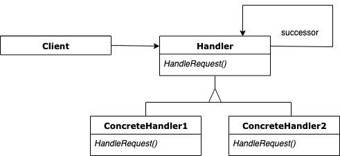

# 책임 연쇄 패턴


```java
public class Request {
}
```
```java
@RequiredArgsConstructor
public class Client {

    private final Handler handler;

    public void requestProceed(Request request) {
        Handler handler = new AuthHandler(new LoggingHandler(new CoreHandler()));
        handler.handleRequest(request);
    }
}
```
```java
@NoArgsConstructor
public abstract class Handler {

    private Handler nextHandler;

    public Handler(Handler nextHandler) {
        this.nextHandler = nextHandler;
    }

    public void handleRequest(Request request) {
        if (nextHandler != null) {
            nextHandler.handleRequest(request);
        }
    }
}
```
```java
public class AuthHandler extends Handler {

    public AuthHandler(Handler nextHandler) {
        super(nextHandler);
    }

    @Override
    public void handleRequest(Request request) {
        System.out.println("인증");
        super.handleRequest(request);
    }
}
```
```java
public class LoggingHandler extends Handler{

    public LoggingHandler(Handler nextHandler) {
        super(nextHandler);
    }

    @Override
    public void handleRequest(Request request) {
        System.out.println("로깅");
        super.handleRequest(request);
    }
}
```
```java
@NoArgsConstructor
public class CoreHandler extends Handler {

    public CoreHandler(Handler nextHandler) {
        super(nextHandler);
    }

    @Override
    public void handleRequest(Request request) {
        System.out.println("요청 처리");
        super.handleRequest(request);
    }
}
```
* SRP를 지키는 객체들이 체인의 형태로 연결되어 있는 패턴이다.
* 이 패턴은 요청을 보내는 객체와 요청을 처리하는 객체를 분리하여 결합도를 낮추고, 요청을 처리하는 객체들을 분리하여 결합을 느슨하게 만들기 위한 패턴이다. 각 요청 처리 객체들은 다음에 요청을 처리하는 객체가 어떤 객체인지 모르는 채로 요청을 넘긴다. 또한 새로운 요청 처리 객체가 추가되더라도 클라이언트 코드를 변경할 필요가 없다.