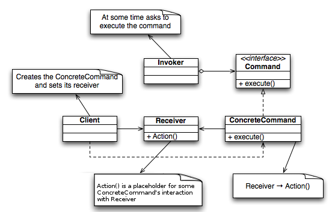

# 커맨드 패턴


```java
//클라이언트는 invoker에 들어갈 command를 지정하고, command에 들어갈 receiver를 지정하고 실행한다.
@RequiredArgsConstructor
public class Client {

    public void execute() {
        Invoker invoker = new Invoker(new ConcreteCommandA(new Receiver()),
                new ConcreteCommandB(new Receiver()));
        invoker.invokeA();
        invoker.invokeB();
    }
}
```
```java
// invoker에 주입되는 commandA, commandB 객체 묶음이 invoker의 행위, 로직을 결정한다.
@RequiredArgsConstructor
public class Invoker {

    private final Command commandA;
    private final Command commandB;

    public void invokeA() {
        commandA.execute();
    }

    public void invokeB() {
        commandB.execute();
    }
}
```
```java
// command를 구현하고 주입함으로써 invoker가 수행할 로직을 구체화할 수 있다.
public interface Command {

    public void execute();
}
```
```java
@RequiredArgsConstructor
public class ConcreteCommandA implements Command {

    private final Receiver receiver;

    @Override
    public void execute() {
        receiver.actionA();
    }
}
```
```java
@RequiredArgsConstructor
public class ConcreteCommandB implements Command {

    private final Receiver receiver;

    @Override
    public void execute() {
        receiver.actionB();
    }
}
```
```java
// command를 통해 수행하는 실질적인 행위, 로직이 receiver에 들어간다. 하지만 굳이 Receiver를 만들필요 없으면 없어도 무방하다.
public class Receiver {

    public void actionA() {
        System.out.println("action A");
    }

    public void actionB() {
        System.out.println("action B");
    }
}
```
* 커맨드 패턴은 기능을 추가할 때 특정 기능을 수행하는 command 객체 묶음을 추가하기만 한다면 클라이언트의 코드를 바꾸지 않아도 되기 때문에 OCP원칙을 지킨다. 또한 기능을 command별로 나누기 때문에 SRP원칙도 지킨다.
* 클라이언트가 어떤 로직을 수행할 지 command를 주입함으로써 결정한다. 실질적인 로직은 command 인터페이스를 구현함으로써 구체화할 수 있다. 
* invoker는 여러 command 객체를 주입받고 command 객체의 메서드를 실행하는 객체이다.
* client는 invoker에 command 구현체를 주입하고, command에 receiver를 주입하여 invoker가 어떤 로직을 실행할지 결정하고 invoker의 메서드를 실행한다.
* 하나의 로직(invoker가 이 로직을 가지고있다)을 여러개의 커맨드로 나눌 수 있고 그 여러 커맨드가 하나의 리시버를 의존하는 경우에 커맨드 패턴을 유용하게 쓸 수 있을듯?