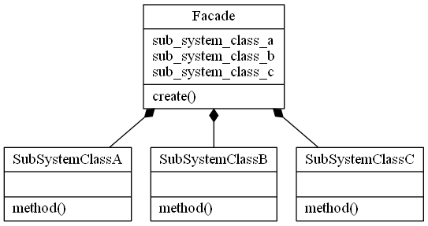

# 퍼사드 패턴


## 퍼사드 적용 전
```java
@RequiredArgsConstructor
public class Client {

    private final SubSystemA subSystemA;
    private final SubSystemB subSystemB;
    private final SubSystemC subSystemC;

    public void execute() {
        subSystemA.operation();
        subSystemB.operation();
        subSystemC.operation();     
    }
}
```
```java
public class SubSystemA {

    public void operation() {
        System.out.println("operate SubSystemA");
    }
}
```
```java
public class SubSystemB {

    public void operation() {
        System.out.println("operate SubSystemB");
    }
}
```
```java
public class SubSystemC {

    public void operation() {
        System.out.println("operate SubSystemC");
    }
}
```
* Client가 SubSystemA, SubSystemB, SubSystemC에 의존적이다.
## 퍼사드 적용 후
```java
public class Client {
    public void execute() {
        Facade facade = new Facade(new SubSystemA(), new SubSystemB(), new SubSystemC());
        facade.execute();
    }
}
```
```java
public class Facade {

    private final SubSystemA subSystemA;
    private final SubSystemB subSystemB;
    private final SubSystemC subSystemC;

    public Facade(SubSystemA subSystemA, SubSystemB subSystemB, SubSystemC subSystemC) {
        this.subSystemA = subSystemA;
        this.subSystemB = subSystemB;
        this.subSystemC = subSystemC;
    }

    public void execute() {
        subSystemA.operation();
        subSystemB.operation();
        subSystemC.operation();
    }
}
```
* Client가 SubSystemA, SubSystemB, SubSystemC에 의존하는 대신 Facade에 의존한다. 결국에는 Facade가 SubSystemA, SubSystemB, SubSystemC에 의존적이기 때문에 그게 그거라 생각할 수 있겠지만 SubSystem에 대한 의존성을 한 곳으로 모을 수 있고, 만약 해당 Facade를 여러번 사용하는 경우가 있다면 코드 재사용성에 있어서도 퍼사드 패턴을 사용하는 것이 좋다. 또한 Client 코드에 대한 가독성도 더 좋아진다.
* 테스트 코드를 작성하는데 있어 퍼사드 패턴을 사용하는 것이 더 유리하다.