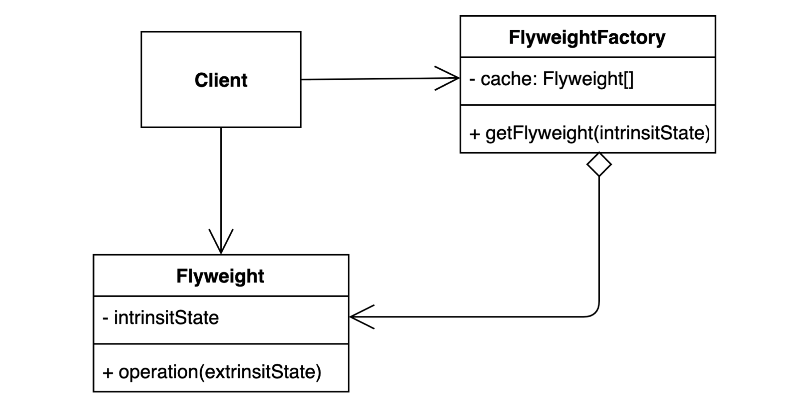

# 플라이웨이트 패턴


```java
@RequiredArgsConstructor
public class Client {

    private final FlyweightFactory flyweightFactory;

    public void execute() {
        Component com1 = new Component("abc", 22, flyweightFactory.getFlyweight("abc, 22"));
        Component com2 = new Component("def", 722, flyweightFactory.getFlyweight("abc, 22"));
        Component com3 = new Component("ghi", 169, flyweightFactory.getFlyweight("abc, 22"));
        System.out.println(com1);
        System.out.println(com2);
        System.out.println(com3);
    }
}
```
```java
@RequiredArgsConstructor
@Getter
public class Component {

    private final String extrinsicString;

    private final Integer extrinsicInteger;

    private final Flyweight flyweight;

    @Override
    public String toString() {
        return "Component{" +
                "extrinsicString='" + extrinsicString + '\'' +
                ", extrinsicInteger=" + extrinsicInteger +
                ", " + flyweight.toString();
    }
}
```
```java
@RequiredArgsConstructor
@Getter
public class Flyweight {

    private final String intrinsicString;
    private final Integer intrinsicInteger;

    @Override
    public String toString() {
        return "intrinsicString='" + intrinsicString + '\'' +
                ", intrinsicInteger=" + intrinsicInteger +
                '}';
    }
}
```
```java
public class FlyweightFactory {

    private final Map<String, Flyweight> cache = new HashMap<>();

    public Flyweight getFlyweight(String intrinsic) {
        if (cache.containsKey(intrinsic)) {
            return cache.get(intrinsic);
        } else {
            String[] split = intrinsic.split(", ");
            Flyweight flyweight = new Flyweight(split[0], Integer.parseInt(split[1]));
            cache.put(intrinsic, flyweight);
            return flyweight;
        }
    }
}
```
* 플라이웨이트 패턴은 자주 변하는 속성(Extrinsic)과 자주 변하지 않는 속성(Intrinsic)을 분리하고 캐싱을 통해 재사용하여 메모리 사용을 줄이는 디자인 패턴이다.
* 위의 예시에서는 Client의 execute() 메서드 내에서 com1, com2, com3가 같은 Flyweight 객체를 공유하기 때문에 메모리를 아낄 수 있다.