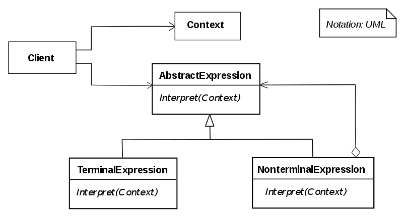

# 인터프리터 패턴


```java
//Client
public class App {

    public static void main(String[] args) {
        PostfixExpression expression = PostfixParser.parse("xyz+-");
        int result = expression.interpret(Map.of('x', 1, 'y', 2, 'z', 3));
        System.out.println(result);
    }
}
```
```java
//AbstractExpression
public interface PostfixExpression {

    int interpret(Map<Character, Integer> context);
}
```
```java
//NonterminalExpression
public class PlusExpression implements PostfixExpression{

    private PostfixExpression left;
    private PostfixExpression right;

    public PlusExpression(PostfixExpression left, PostfixExpression right) {
        this.left = left;
        this.right = right;
    }


    @Override
    public int interpret(Map<Character, Integer> context) {
        return left.interpret(context) + right.interpret(context);
    }
}
```
```java
//NonterminalExpression
public class MinusExpression implements PostfixExpression{

    private PostfixExpression left;
    private PostfixExpression right;

    public MinusExpression(PostfixExpression left, PostfixExpression right) {
        this.left = left;
        this.right = right;
    }


    @Override
    public int interpret(Map<Character, Integer> context) {
        return left.interpret(context) - right.interpret(context);
    }
}
```
```java
//TerminalExpression
public class VariableExpression implements PostfixExpression{

    private Character variable;

    public VariableExpression(Character variable) {
        this.variable = variable;
    }

    @Override
    public int interpret(Map<Character, Integer> context) {
        return context.get(variable);
    }
}
```
* 어떤 언어에 대해 해당 언어로된 특정 패턴의 문장이 주어졌을 때 그 특정한 패턴을 가지는 문장을 해석하는 인터프리터를 사용하여 언어를 해석하는 패턴이다. 언어에서 해당 패턴이 자주 쓰이는 패턴일 때 인터프리터 패턴을 사용하면 좋다.
* 해당 언어의 문법을 작은 문제, 패턴으로 쪼개서 트리형태의 구조로 만들어 언어를 해석한다.
* 컴포지트 패턴과 유사하다.