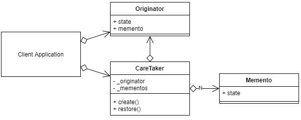

# 메멘토 패턴


```java
public class Client {

    private final Originator originator;

    private final Caretaker caretaker;

    public Client(Originator originator) {
        this.originator = originator;
        caretaker = new Caretaker(originator);
    }

    public void execute() {
        originator.setState("state1");
        caretaker.save();
        originator.setState("state2");
        caretaker.save();
        originator.setState("state3");

        System.out.println(originator.getState());
        caretaker.rewind();
        System.out.println(originator.getState());
        caretaker.rewind();
        System.out.println(originator.getState());
    }
}
```
```java
public class Originator {

    private String state;

    public String getState() {
        return state;
    }

    public void setState(String state) {
        this.state = state;
    }

    public Memento save() {
        return new Memento(this.state);
    }

    public void restore(Memento memento) {
        this.state = memento.getState();
    }
}
```
```java
public class Caretaker {

    private final Originator originator;

    private final Stack<Memento> savedMemento = new Stack<>();

    public Caretaker(Originator originator) {
        this.originator = originator;
    }

    public void save() {
        Memento memento = originator.save();
        savedMemento.push(memento);
    }

    public Originator rewind() {
        if (!savedMemento.empty()) {
            Memento memento = savedMemento.pop();
            originator.restore(memento);
        }
        return this.originator;
    }
}
```
```java
public final class Memento {

    private final String state;

    public Memento(String state) {
        this.state = state;
    }

    public String getState() {
        return state;
    }
}
```
* 메멘토 패턴은 객체의 이전상태를 기억하고 그 상태로 복원하기 위해 사용하는 디자인 패턴이다.
* 클라이언트가 Memento와 Caretaker 없이 Originator의 이전상태를 복원하려면 Client가 Originator의 이전상태를 기억하고 있어야 한다. 하지만 이것은 Originator의 캡슐화도 깨지는 것이고 Client의 SRP도 성립하지 않기 때문에 좋지 않다. 하지만 메멘토 패턴을 사용하면 Originator의 이전상태를 기억하는 책임은 Memento가 가지고, 이러한 Memento를 가지고 상태를 복원하는 책임을 Caretaker가 가지고 있기 때문에 SRP가 성립하고 Memento와 그 멤버들을 final로 정의했기 때문에 Originator의 캡슐화도 깨지지 않는다.