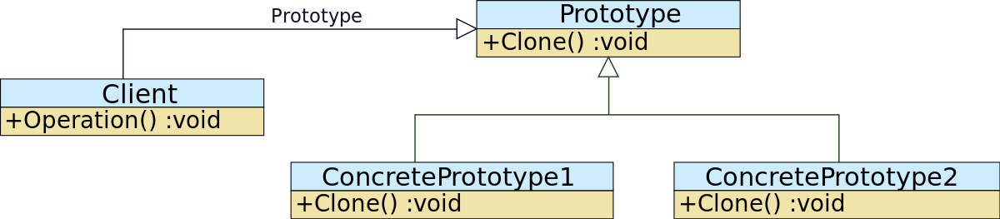

# 프로토타입 패턴


```java
public class Element {
    
    private String word;

    public Element() {}

    public Element(Element element) {
        this.word = element.getWord();
    }

    public String getWord() {
        return word;
    }
}
```
```java
public class ConcretePrototype impliments Cloneable {

    private Element element;

    public void setElement(Element element) {
        this.element = element;
    }

    @Override
    protected Object clone() throws CloneNotSupportedException {
        // return super.clone(); -> 얕은 복사
        ConcretePrototype prototype = new ConcretePrototype();
        prototype.setElement(new Element(element));
        return prototype;
    }
}
```
```java
public class Client {

    public void operation() throws CloneNotSupportedException {
        ConcretePrototype prototypeA = new ConcretePrototype();
        prototypeA.setElement(new Element());

        ConcretePrototype prototypeB = (ConcretePrototype) prototypeB.clone()
    }
}
```
* 프로토타입 패턴은 객체를 초기화할 때의 비용이 큰 경우(거의 변하지 않는 데이터를 데이터베이스로 부터 받아와야 한다거나, 데이터를 받아 파싱을 해야한다거나...) 이미 있는 객체를 복사하여 새로운 객체를 만들어 이러한 오버헤드를 줄일 수 있다.
* 자바에서는 Object 타입에 clone()메서드가 protected로 정의되어 있는데 Cloneable을 구현하여 해당 메서드를 사용할 수 있다. 만약 사용하는 언어가 이러한 인터페이스를 지원하지 않는다면 직접 인터페이스를 만들면 된다.
* 자바에서 Object에 기본으로 정의되어있는 clone()메서드인 super.clone()을 사용하면 얕은 복사가 된다. 따라서 만약 clone한 객체가 primitive 타입뿐만 아니라 reference 타입도 가지고 있다면 복제한 객체들끼리 서로 같은 객체를 참조하기 때문에 서로 간에 영향을 주게 된다. 그러길 원하지 않는다면 super.clone()을 사용하지 않고 직접 깊은 복사를 하는 로직을 짜야한다.