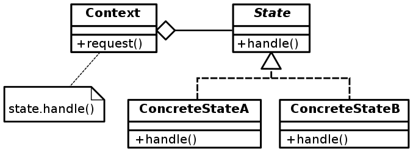

# 상태 패턴


```java
//Context
public class Person {

    private State state = new Holiday(this);
    private long asset = 0;


    public State getState() {
        return state;
    }

    public void setState(State state) {
        this.state = state;
    }

    public long getAsset() {
        return asset;
    }

    public void setAsset(long asset) {
        this.asset = asset;
    }

    public void doing() {
        state.doing();
    }
}
```
```java
public interface State {

    void doing();
}
```
```java
public class Weekday implements State{

    private final Person person;

    public Weekday(Person person) {
        this.person = person;
    }

    @Override
    public void doing() {

        long asset = person.getAsset();
        if (asset > 1000000000) {
            System.out.println("나가 논다.");
            person.setAsset(asset - 10000000);
        } else if (asset > 100000000) {
            System.out.println("집에서 쉰다.");
            person.setAsset(asset - 10000);
        } else {
            System.out.println("일한다.");
            person.setAsset(asset + 100000);
        }
    }
}
```
```java
public class Weekend implements State {

    private final Person person;

    public Weekend(Person person) {
        this.person = person;
    }

    @Override
    public void doing() {

        long asset = person.getAsset();
        if (asset > 10000000) {
            System.out.println("나가 논다.");
            person.setAsset(asset - 1000000);
        } else if (asset > 1000000) {
            System.out.println("집에서 쉰다.");
            person.setAsset(asset - 10000);
        } else {
            System.out.println("일한다.");
            person.setAsset(asset + 100000);
        }
    }
}
```
```java
public class Holiday implements State{

    private final Person person;

    public Holiday(Person person) {
        this.person = person;
    }

    @Override
    public void doing() {

        long asset = person.getAsset();
        if (asset > 1000000) {
            System.out.println("나가 논다.");
            person.setAsset(asset - 1000000);
        } else if (asset > 100000) {
            System.out.println("집에서 쉰다.");
            person.setAsset(asset - 10000);
        } else {
            System.out.println("일한다.");
            person.setAsset(asset + 100000);
        }
    }
}
```
* Context의 상태에 따라 실행하는 로직이 달라질 때 사용하는 디자인 패턴이다.
* Context의 상태가 2개 정도면 조건문을 써도 충분히 가독성이 좋지만 상태가 많아지면 많아질 수록 조건문이 복잡해지고 가독성이 나빠진다. 이러한 경우에 상태 패턴을 사용하는 것이 좋다.
* 원래는 상태에 따른 로직을 Context 안에서 전부 관리했다면 상태 패턴을 사용할 때는 상태에 따른 로직을 개별 클래스에 옮겨서 따로 관리하게 된다. 그렇기 때문에 새로운 상태가 만들어 진다면 Context의 코드를 수정할 필요 없이 새로운 상태에 따른 동작을 관리하는 클래스를 추가해주면 된다.(OCP)