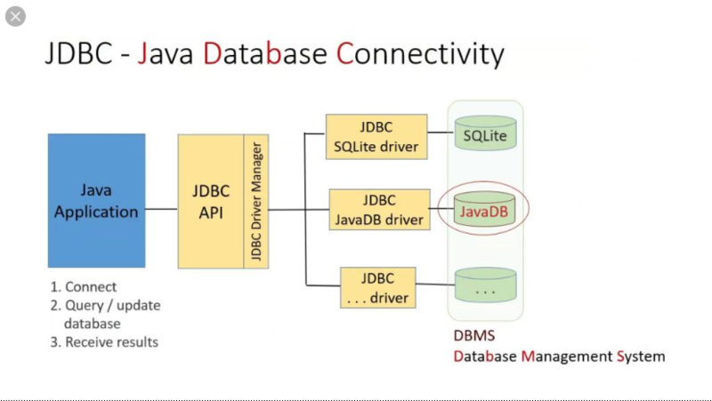

# JDBC
## JDBC란


*  JDBC는 자바가 제공해주는 데이터베이스와의 연결을 위한 인터페이스이다. 각각의 데이터베이스는 커넥션을 연결하는 방법, SQL을 전달하는 방법, 그리고 결과를 응답 받는 방법이 모두 다르다. 그렇기 때문에 만약 JDBC가 없다면 개발자는 데이터베이스마다 커넥션 연결, SQL 전달, 결과를 응답 받는 방법을 따로 학습해야할 것이다.
* 다만, JDBC를 사용하더라도 SQL은 ANSI 표준이 있기는 하지만 데이터베이스의 일반적인 부분만 표준화 됐기 때문에 SQL를 짤 때는 각각의 데이터베이스마다 다른 SQL를 짜야한다.
* MyBatis나 JDBCTemplate과 같은 SQL Mapper, 혹은 JPA 같은 ORM은 전부 이러한 JDBC를 기반으로 만들어진다.
* 참고로 JDBCTemplate는 JDBC를 사용할 때 반복적으로 사용되어지는 로직을 템플릿 메서드 패턴, 혹은 전략패턴을 통해 반복을 없앤 것이다.
```java
@Slf4j
public class MemberRepository {
    
    public Member findById(String memberId) throws  SQLException {
        String sql = "select * from member where member_id = ?";

        Connection conn = null;
        PreparedStatement pstmt = null;
        ResultSet rs = null;

        try {
            //데이터베이스 커넥션 얻어옴
            conn = getConnection();
            //문자열로 작성된 sql 을 쿼리로 날릴 수 있도록 변환함
            pstmt = conn.prepareStatement(sql);
            //파라미터 바인딩
            pstmt.setString(1, memberId);
            //select 쿼리 실행
            rs = pstmt.executeQuery();
            //ResultSet 은 select 쿼리 결과
            if (rs.next()) {
                Member member = new Member();
                member.setMemberId(rs.getString("member_id"));
                member.setMoney(rs.getInt("money"));
                return member;
            }
            throw new NoSuchElementException("member not found, memberId = " + memberId);
        } catch (SQLException e) {
            log.error("db error", e);
            throw e;
        } finally {
            //데이터베이스 사용 후 리소스 반환 필수, 반환 안하면 리소스 누수 발생
            close(conn, pstmt, rs);
        }
    }

    private void close(Connection conn, Statement stmt, ResultSet rs) {
        if (stmt != null) {
            try {
                //PreparedStatement : 데이터 바인딩 가능한 sql
                //Statement : 데이터 바인딩 안되는 sql
                stmt.close();
            } catch (SQLException e) {
                log.error("error", e);
            }
        }
        if (conn != null) {
            try {
                conn.close();
            } catch (SQLException e) {
                log.error("error", e);
            }
        }
        if (rs != null) {
            try {
                rs.close();
            } catch (SQLException e) {
                log.error("error", e);
            }
        }
    }

    private Connection getConnection() {
        try {
            //데이터베이스 커넥션 얻어옴
            Connection connection = DriverManager.getConnection("jdbc:h2:tcp://localhost/~/test", "sa", "");
            return connection;
        } catch (SQLException e) {
            throw new IllegalStateException(e);
        }
    }
}
```
* JDBC 동작 순서
  1. 데이터베이스 커넥션 얻어오기
  2. 문자열인 SQL을 PreparedStatement 혹은 Statement로 변환
  3. PreparedStatement의 경우 파라미터 바인딩
  4. 데이터베이스에 쿼리 날려 결과 값 받기
  5. 리소스 반환
* 위의 과정을 보면 데이터베이스 커넥션을 받아오고, 리소스를 반환하는 것 까지의 여러 과정에서 데이터베이스에 쿼리를 날리는 데 공통적으로 행해져야할 과정이 많다. 이러한 공통적인 부분을 디자인 패턴을 사용해서 공통화 한 것이 JDBCTemplate이다.
## DataSource
```java
@Slf4j
@RequiredArgsConstructor
public class MemberRepository {

    //DataSource는 DB커넥션을 얻어오는 방법을 추상화한 인터페이스이다.
    private final DataSource dataSource;

    public Member findById(String memberId) throws SQLException {
        String sql = "select * from member where member_id = ?";

        Connection conn = null;
        PreparedStatement pstmt = null;
        ResultSet rs = null;

        try {
            //데이터베이스 커넥션 얻어옴
            conn = getConnection();
            //문자열로 작성된 sql 을 쿼리로 날릴 수 있도록 변환함
            pstmt = conn.prepareStatement(sql);
            //파라미터 바인딩
            pstmt.setString(1, memberId);
            //select 쿼리 실행
            rs = pstmt.executeQuery();
            //ResultSet 은 select 쿼리 결과
            if (rs.next()) {
                Member member = new Member();
                member.setMemberId(rs.getString("member_id"));
                member.setMoney(rs.getInt("money"));
                return member;
            }
            throw new NoSuchElementException("member not found, memberId = " + memberId);
        } catch (SQLException e) {
            log.error("db error", e);
            throw e;
        } finally {
            //데이터베이스 사용 후 리소스 반환 필수, 반환 안하면 리소스 누수 발생
            close(conn, pstmt, rs);
        }
    }

    private void close(Connection conn, Statement stmt, ResultSet rs) {

        // JdbcUtils를 사용하면 손 쉽게 리소스 반환 가능(커넥션 풀 사용시 리소스를 풀에 반환하는 로직을 따로 짤 필요 없음)
        JdbcUtils.closeResultSet(rs);
        JdbcUtils.closeStatement(stmt);
        JdbcUtils.closeConnection(conn);
    }

    private Connection getConnection() throws SQLException {
        Connection connection = dataSource.getConnection();
        log.info("get connection={}, class={}", connection, connection.getClass());
        return connection;
    }
}
```
```java
@Slf4j
class MemberRepositoryTest {

    MemberRepository repository;

    @Test
    void crud() throws SQLException {

        // 항상 새로운 DB커넥션 획득
        // 기존 DriverManager는 DataSource의 구현체가 아니라 DataSource를 사용해서 커넥션 획득이 불가능하다.
        // DriverManagerDataSource는 DataSource의 구현체로 DriverManger를 통해 항상 새로운 커넥션을 생성하도록 한다.
        // DataSource dataSource = new DriverManagerDataSource(URL, USERNAME, PASSWORD);

        // HikariCP는 DB커넥션 풀로써, HikariDataSource 구현체를 통해 HikariCP의 커넥션 풀에서 커넥션을 가져올 수 있다.
        HikariDataSource dataSource = new HikariDataSource();
        dataSource.setJdbcUrl(URL);
        dataSource.setUsername(USERNAME);
        dataSource.setPassword(PASSWORD);

        Member findMember = repository.findById("member");
        assertThat(findMember).isEqualTo(member);
```
* DriverManager를 통해 커넥션을 획득하는 것은 DB와의 연결이 필요할 때마다 TCP 3-way handshake 등의 과정을 통해 DB와 연결하기 때문에 비용이 많이 든다. 하지만 미리 DB와 연결을 해둔 커넥션들을 커넥션 풀에 저장해두고 DB와의 연결이 필요하면 커넥션을 가져다 쓴다면 이러한 비용을 최소화 할 수 있다.
* DataSource는 이러한 DB커넥션을 얻어오는 방법을 추상화한 인터페이스이다.
* 기존의 DriverManager는 DataSource의 구현체가 아니기 때문에 DataSource를 통해 DriverManager를 사용하지 못한다. 하지만 DriverManager를 통해 연결이 필요할 때마다 커넥션을 생성하는 방법을 제공하기 위해 DataSource는 DriverManagerDataSource 구현체를 제공한다.(DriverManagerDataSource가 DriverManager를 사용해 커넥션 생성)
* DataSource를 사용함으로써 커넥션 풀을 바꾼다 하더라도 기존의 코드를 전혀 손댈 필요가 없어진다.