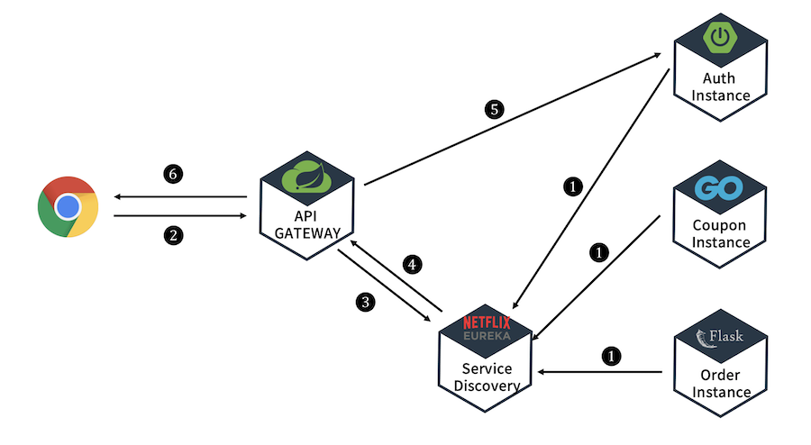

# API Gateway
## 구조


1. 각 마이크로서비스를 넷플릭스 유레카에 등록한다.
2. 클라이언트가 API 게이트웨이로 요청을 보낸다.
3. API 게이트웨이는 해당 url을 어떤 마이크로서비스로 포워딩할지 알아내기 위해 넷플릭스 유레카에 요청을 보낸다.
4. 넷플릭스 유레카는 마이크로서비스에 해당하는 아이피와 포트번호를 보낸다.
5. API 게이트웨이는 요청을 마이크로서비스로 보내고, 마이크로서비스는 요청을 처리하여 응답을 API 게이트웨이로 보내 최종적으로 클라이언트로 응답이 도달하게 된다.
## 필터 설정
### yml 파일에서 필터 설정
```yml
server:
  port: 8000

eureka:
  client:
    register-with-eureka: true
    fetch-registry: true
    service-url:
      default-zone: http://localhost:8761/eureka

spring:
  application:
    name: apigateway-service
  cloud:
    gateway:
      default-filters: # 모든 서비스에 필터를 적용하고 싶을 때
        - name: GlobalFilter # 해당하는 이름의 클래스를 filter 로 적용한다.
          args: # 필터의 내부 클래스(Config)에 들어있는 멤버를 초기화 한다.
            baseMessage: Spring Cloud Gateway Global Filter
            preLogger: true
            postLogger: true
      routes:
        - id: first-service # 라우팅 id 값, 마이크로서비스의 application name이랑은 다른거임
#          uri: http://localhost:8081/
          uri: lb://MY-FIRST-SERVICE
          predicates:
            - Path=/first-service/** # http://localhost:8000/first-service/** 로 들어오는 모든 요청은 http://localhost:8001/first-service/** 로 라우팅됨
          filters: # 필터 적용
#            - AddRequestHeader=first-request, first-request-header
#            - AddResponseHeader=first-response, first-response-header
            - CustomFilter # 해당 서비스에 내가 만든 필터를 적용한다.
        - id: second-service
#          uri: http://localhost:8082/
          uri: lb://MY-SECOND-SERVICE
          predicates:
            - Path=/second-service/** # http://localhost:8000/second-service/** 로 들어오는 모든 요청은 http://localhost:8001/second-service/** 로 라우팅됨
          filters: # 필터 적용
#            - AddRequestHeader=second-request, second-request-header
#            - AddResponseHeader=second-response, second-response-header
            - name: CustomFilter # 필터의 추가적인 정보(args 등)를 등록하고 싶으면 'name:'을 앞에 붙여줘야함
            - name: LoggingFilter
              args: # 필터의 내부 클래스(Config)에 들어있는 멤버를 초기화 한다.
                baseMessage: Hi, there.
                preLogger: true
                postLogger: true
```
### 자바 파일에서 필터 설정
```java
@Configuration
public class FilterConfig {

    @Bean
    public RouteLocator gatewayRoutes(RouteLocatorBuilder builder) {
        return builder.routes()
                .route(r ->
                        r.path("/first-service/**") // 해당 url 로 요청이 들어왔을 때 적용함
                        .filters(f -> // 필터를 적용할 때 사용
                                f.addRequestHeader("first-request", "first-request-header")
                                .addResponseHeader("first-response", "first-response-header"))
                        .uri("http://localhost:8081")) // 해당하는 uri 로 라우팅
                .route(r ->
                        r.path("/second-service/**") // 해당 url 로 요청이 들어왔을 때 적용함
                                .filters(f -> // 필터를 적용할 때 사용
                                        f.addRequestHeader("second-request", "second-request-header")
                                                .addResponseHeader("second-response", "second-response-header"))
                                .uri("http://localhost:8082")) // 해당하는 uri 로 라우팅
                .build(); // 마지막에 꼭 붙여줘야함
    }
}
```
* 필터 설정은 yml 파일에서도 가능하고 자바 파일에서도 가능한데 취향껏 하면 된다.
* 자바파일로 설정하는 경우에는 RouteLocatorBuilder를 통해 필터 설정으로 하고 RouteLocator 객체를 만들어 해당 객체를 빈으로 등록해주면 된다.
## 필터
```java
@Component
@Slf4j
public class GlobalFilter extends AbstractGatewayFilterFactory<GlobalFilter.Config> {

    public GlobalFilter() {
        super(Config.class);
    }

    // 파라미터로 Config 정보가 들어있는 객체가 들어온다.
    // 필터 작동 순서 : global pre filter -> custom pre filter -> custom post filter -> global post filter
    @Override
    public GatewayFilter apply(Config config) {

        // pre filter
        return ((exchange, chain) -> {
            ServerHttpRequest request = exchange.getRequest();
            ServerHttpResponse response = exchange.getResponse();

            log.info("Global Filter baseMessage : {}", config.getBaseMessage());

            if (config.isPreLogger()) {
                log.info("Global Filter start : request id -> {}", request.getId());
            }
            // pre filter에 chaining 으로 post filter 가 추가됨
            return chain.filter(exchange).then(Mono.fromRunnable(() -> {
                if (config.isPreLogger()) {
                    log.info("Global Filter end : response status code -> {}", response.getStatusCode());
                }
            }));
        });
    }

    @Getter
    @Setter
    public static class Config {
        // 여기에 CustomFilter의 Configuration 정보를 넣는다.
        // 해당 정보는 application.yml 에서 초기화 한다.
        private String baseMessage;
        private boolean preLogger;
        private boolean postLogger;
    }
}
```
```java
@Component
@Slf4j
public class LoggingFilter extends AbstractGatewayFilterFactory<LoggingFilter.Config> {

    public LoggingFilter() {
        super(Config.class);
    }

    // 파라미터로 Config 정보가 들어있는 객체가 들어온다.
    // 필터 작동 순서 : global pre filter -> custom pre filter -> custom post filter -> global post filter
    @Override
    public GatewayFilter apply(Config config) {

        GatewayFilter filter = new OrderedGatewayFilter(((exchange, chain) -> {
            ServerHttpRequest request = exchange.getRequest();
            ServerHttpResponse response = exchange.getResponse();

            log.info("Logging Filter baseMessage : {}", config.getBaseMessage());

            if (config.isPreLogger()) {
                log.info("Logging Pre Filter : request id -> {}", request.getId());
            }
            return chain.filter(exchange).then(Mono.fromRunnable(() -> {
                if (config.isPreLogger()) {
                    log.info("Logging Post Filter : response status code -> {}", response.getStatusCode());
                }
            }));
        }), Ordered.HIGHEST_PRECEDENCE); // 두번째 파라미터(Ordered.HIGHEST_PRECEDENCE)는 필터의 우선순위(적용 순서)
        // Ordered.HIGHEST_PRECEDENCE 는 가장 앞선순위를 말하는데 global 필터보다도 앞선다.

        return filter;
    }

    @Getter
    @Setter
    public static class Config {
        // 여기에 CustomFilter의 Configuration 정보를 넣는다.
        // 해당 정보는 application.yml 에서 초기화 한다.
        private String baseMessage;
        private boolean preLogger;
        private boolean postLogger;
    }
}
```
* 필터는 AbstractGatewayFilterFactory<>를 상속받아 구현할 수 있다. 여기서 제네릭으로 해당 클래스 내에서 설정에 사용할 내부 클래스를 넣는다.
* 설정에 사용할 내부 클래스의 멤버는 yml 파일에서 초기화 가능하다.
* API 게이트웨이는 WebMVC 기반이 아닌 Webflux 기반으로 동작하기 때문에 HttpServletRequest, HttpServletResponse가 아닌 ServerHttpRequest, ServerHttpResponse를 사용해야한다.
* Webflux 기반이기 때문에 서버도 Tomcat이 아닌 Netty를 사용한다.