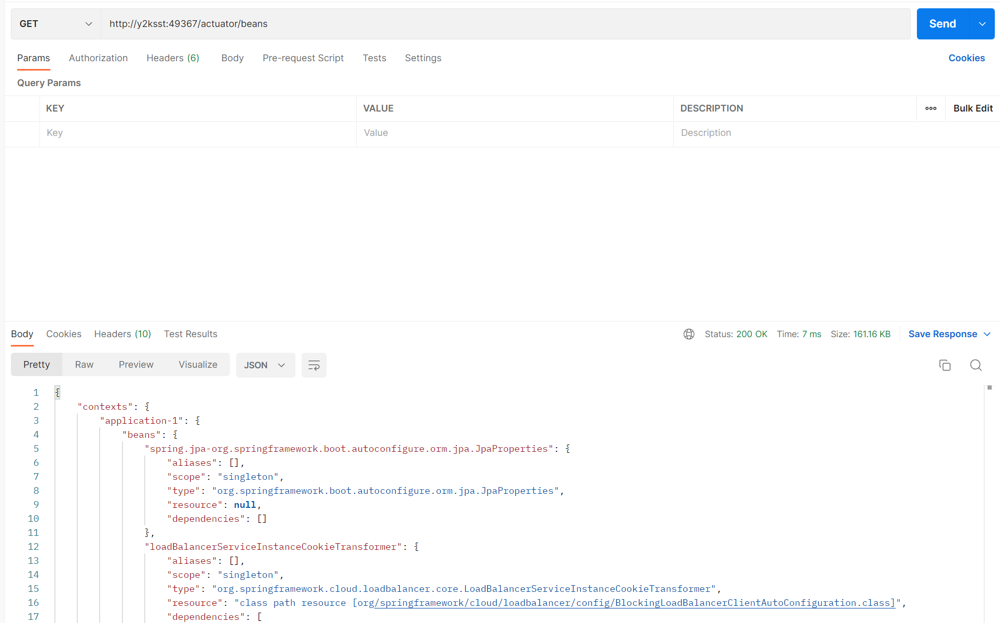

# Configuration Server
## Configuration Server 생성


* 하나의 디렉토리에 각 마이크로서비스들이 사용할 프로파일별 yml 파일들을 모아둔다.
* 해당 디렉토리를 git을 사용해 관리한다. 단, 원격 리포지토리에 관리할지는 선택
```java
@SpringBootApplication
@EnableConfigServer // 필수
public class ConfigServiceApplication {

	public static void main(String[] args) {
		SpringApplication.run(ConfigServiceApplication.class, args);
	}

}
```
* 프로젝트를 생성할 때 의존성에 Spring Cloud Config의 Config Server를 추가한다.
* 프로젝트를 생성하면 메인함수가 있는 클래스에 @EnableConfigServer를 추가해준다.
```yml
# ecommerce.yml 파일
# file://C:\spring_cloud\git-local-repo 하위에 존재한다.
# 깃으로 관리되고있어야 한다.(리모트 리포지토리로는 관리될 필요X)
token:
  expiration_time: 86400000
  secret: FOJ2@#FJ33TF@#5Ffom#!@3@kkf2#$2FF234f2#gmFOJ2@#FJ33TF@#5Ffom#!@3@kkf2#$2FF234f2#gm-default

gateway:
  ip: 192.168.0.8
```
```yml
server:
  port: 8888

spring:
  application:
    name: config-server
  cloud:
    config:
      server:
        git:
          default-label: master # 깃허브 default 브랜치 이름이 main이 아닐 때 적어주자
#          uri: file://C:\spring_cloud\git-local-repo
          uri: https://github.com/dlwldyd/git-local-repo.git
#          username: {username} private repo 사용 시 깃허브 아이디와 패스워드를 넣어줘야한다.
#          password: {password}
```


* Config Server의 yml 파일에 다른 마이크로서비스들이 사용할 yml 파일들이 있는 uri를 명시해준다.
* localhost:8888/{yml file name}/{profile name} 으로 어떤 파일이 불러와지는지 알 수 있다.
* 만약 존재하지 않는 yml 파일이면 위 사진에서 propertySources 이후의 값이 없는 채로 오고, 존재하지 않는 profile이면 default 프로파일이 온다.
```yml
server:
  port: 8888

spring:
  application:
    name: config-server
 profiles:
   active: native # native(git 사용X)로 사용하고 싶으면 넣어줘야한다.
  cloud:
    config:
      server:
       native:
         search-locations: file:///${user.home}/OneDrive/Desktop/native-file-repo # 깃으로 관리 안해도됨, 파일경로를 적어준다.
```
* 깃으로 관리하기 싫으면 위와같이 설정을 하면 된다.
## 마이크로서비스와 Config Server 연동
```gradle
// spring cloud config server를 사용하기 위한 dependency
implementation 'org.springframework.cloud:spring-cloud-starter-config'
implementation 'org.springframework.cloud:spring-cloud-starter-bootstrap'
```
* 마이크로서비스와 config server를 연동하기 위해서는 위와 같은 의존성을 추가해줘야한다.
```yml
# bootstrap.yml 파일 추가
spring:
  cloud:
    config:
      uri: http://localhost:8888 # config server 주소
      name: ecommerce # 가지고올 yml 파일 이름
      # name: config-server # config server 의 application 이름을 적으면 application.yml 파일을 가지고온다.
```
* bootstrap.yml 파일을 추가해 위처럼 어디에 있는 config server에서 어떤 설정 파일을 가져올지 명시한다.


* 마이크로서비스를 실행하면 위의 사진처럼 설정파일을 가져오는 로그가 남는 것을 볼 수 있다.
```yml
# userservice의 application.yml 파일

...

#token:
#  expiration-time: 86400000
#  secret: FOJ2@#FJ33TF@#5Ffom#!@3@kkf2#$2FF234f2#gmFOJ2@#FJ33TF@#5Ffom#!@3@kkf2#$2FF234f2#gm
```
```java
@GetMapping("/health_check")
public String status() {
    return String.format("It's Working in User Service, " +
            "port(local.server.port) = %s<br>" +
            "port(server.port) = %s<br>" +
            "token = %s<br>" +
            "token expiration time = %s",
            env.getProperty("local.server.port"),
            env.getProperty("server.port"),
            env.getProperty("token.secret"),
            env.getProperty("token.expiration_time"));
}
```


* 실제로 마이크로서비스의 yml파일에는 token정보를 주석처리해서 없애줬지만 config server에서 해당 정보를 가져오기 때문에 userservice에서 토큰 정보에 접근할 수 있다.
## Config Server에서 설정 값 수정
config server에서 설정값을 수정하면 userservice를 재기동해야 한다. 만약 재기동을 하기 싫으면 2가지 방법이 있는데 첫 번째 방법은 Actuator의 refresh endpoint를 사용하는 방법이 있고 두 번째 방법은 spring cloud bus를 사용하는 방법이 있다.
### Actuator Refresh
```gradle
// actuator 사용을 위한 dependency
implementation 'org.springframework.boot:spring-boot-starter-actuator'
```
* actuator 기능을 하용하려면 위 사진과 같이 의존성을 추가해줘야 한다. actuator 기능자체는 spring boot에 포함되어있다.
```yml
# userservice의 application.yml 파일

# 사용할 actuator의 endpoint를 yml파일에 등록해야 사용할 수 있다.
management:
  endpoints:
    web:
      exposure:
        include: refresh, health, beans
```
* userservice의 application.yml 파일에 사용하고 싶은 actuator의 endpoint를 명시한다.
```java
http.authorizeHttpRequests()
    .antMatchers("/actuator/**").permitAll();
```
* 만약 spring security를 사용하고 있다면 actuator를 사용하기 위한 url을 허용하자


---


* actuator를 통해 서비스에 대한 모니터링 정보를 위의 사진처럼 json 형태로 받아볼 수 있다.
#### 기존의 결과 값


---
#### 수정 후
```yml
# ecommerce.yml 파일
token:
  expiration_time: 86400000
  secret: fix

gateway:
  ip: 192.168.0.8
```
* userservice가 가지고 오는 설정파일 값을 수정한다.


---
* post 방식으로 userservice에 /actuator/refresh 요청을 보내면 userservice는 다시 설정파일에서 값을 가져온다.


---
* 설정 값이 바뀐 것을 확인할 수 있다.
## 프로파일 나누기
```yml
# ecommerce.yml
token:
  expiration_time: 86400000
  secret: FOJ2@#FJ33TF@#5Ffom#!@3@kkf2#$2FF234f2#gmFOJ2@#FJ33TF@#5Ffom#!@3@kkf2#$2FF234f2#gm-default

gateway:
  ip: 192.168.0.8
```
```yml
# ecommerce-dev.yml
token:
  expiration_time: 86400000
  secret: FOJ2@#FJ33TF@#5Ffom#!@3@kkf2#$2FF234f2#gmFOJ2@#FJ33TF@#5Ffom#!@3@kkf2#$2FF234f2#gm-dev

gateway:
  ip: 192.168.0.8
```
```yml
# ecommerce-prod.yml
token:
  expiration_time: 86400000
  secret: FOJ2@#FJ33TF@#5Ffom#!@3@kkf2#$2FF234f2#gmFOJ2@#FJ33TF@#5Ffom#!@3@kkf2#$2FF234f2#gm-prod

gateway:
  ip: 192.168.0.8
```
* config 파일을 {yml 파일 이름}-{프로파일 이름}.yml 로 여러개로 나눈다.
```yml
# user-service의 bootstrap.yml 파일
spring:
  cloud:
    config:
      uri: http://localhost:8888 # config server 주소
      name: ecommerce # 가지고올 yml 파일 이름
      # name: config-server # config server 의 application 이름을 적으면 application.yml 파일을 가지고온다.
  profiles:
    active: dev
```
```yml
# apigateway-service의 bootstrap.yml 파일
spring:
  cloud:
    config:
      uri: http://localhost:8888 # config server 주소
      name: ecommerce # 가지고올 yml 파일 이름
      # name: config-server # config server 의 application 이름을 적으면 application.yml 파일을 가지고온다.
  profiles:
    active: dev
```
* 위와 같이 프로파일을 설정하면 config 파일을 땡길 때 ecommerce-dev.yml 파일을 땡겨온다.
```yml
# user-service의 bootstrap.yml 파일
spring:
  cloud:
    config:
      uri: http://localhost:8888 # config server 주소
      name: ecommerce # 가지고올 yml 파일 이름
      # name: config-server # config server 의 application 이름을 적으면 application.yml 파일을 가지고온다.
  profiles:
    active: prod
```
```yml
# apigateway-service의 bootstrap.yml 파일
spring:
  cloud:
    config:
      uri: http://localhost:8888 # config server 주소
      name: ecommerce # 가지고올 yml 파일 이름
      # name: config-server # config server 의 application 이름을 적으면 application.yml 파일을 가지고온다.
  profiles:
    active: prod
```
* 위와 같이 프로파일을 설정하면 config 파일을 땡길 때 ecommerce-prod.yml 파일을 땡겨온다.
## 암호화
### 대칭키 암호화
```gradle
implementation 'org.springframework.cloud:spring-cloud-starter-bootstrap'
```
```yml
# config server의 bootstrap.yml 파일
encrypt:
  key: abcdefghijklmnopqjstuvwxyz0123456789
```
* bootstrap 의존성을 추가해주고 config server에 bootstrap.yml 파일을 추가한다. 그리고 해당 파일에 암호화를 위한 암호화 키를 넣어준다.


* config server에 /encrypt로 데이터를 보내면 해당 데이터를 암호화한 값이 응답으로 오는 것을 볼 수 있다.
* 암호화된 응답을 config server에 /decrypt로 post 요청을 보내면 복호화된 값이 응답으로 온 것을 볼 수 있다.
```yml
# user-service의 application.yml 파일
spring:
  application:
    name: user-service
  rabbitmq:
    host: 127.0.0.1
    port: 5672
    username: guest
    password: guest
  h2:
    console:
      enabled: true
      settings:
        web-allow-others: true
      path: /h2-console
# 외부에서 값을 가져올 것이기 때문에 주석처리 해준다.
#  datasource:
#    url: jdbc:h2:mem:/~/test
#    username: sa
#    password:
#    driver-class-name: org.h2.Driver
```
```yml
# config server가 외부에서 가져오는 설정값(여기에서는 https://github.com/dlwldyd/git-local-repo.git)
spring:
 datasource:
   url: jdbc:h2:mem:/~/test
   username: sa
   # 작은따옴표로 묶고 앞에 {cipher} 라 적으면 암호화된 값이라는 것을 명시하는 것이다.
   password: '{cipher}30baf106cffc63bbca602196fbd0242494a4e7077995e6acedcaf8f656e7f64f'
   driver-class-name: org.h2.Driver

token:
  expiration_time: 86400000
  secret: FOJ2@#FJ33TF@#5Ffom#!@3@kkf2#$2FF234f2#gmFOJ2@#FJ33TF@#5Ffom#!@3@kkf2#$2FF234f2#gm-application

gateway:
  ip: 192.168.0.8
```
* 암호화가 필요한 값을 config server가 가져오는 외부 yml 파일로 옮겨준다.
* 이 때 암호화된 값은 작은따옴표로 묶고 앞에 {cipher} 라 적어서 암호화된 값이라는 것을 명시한다.


* config server로 부터 설정 값을 확인해보면 spring.datasource.password가 복호화된 값(1234)로 온 것을 볼 수 있다.


* 아무 값이나 입력해서 로그인을 시도하면 로그인이 실패한 것을 볼 수 있지만 정확한 패스워드(1234)를 입력하면 로그인이 성공한 것을 볼 수 있다.
### 비대칭키 암호화
#### 개인키 생성
```
keytool -genkeypair -alias apiEncryptionKey -keyalg RSA -dname "CN=Jiyong, OU=API Development, O=test.co.kr, L=Seoul, C=KR" -keypass "test1234" -keystore apiEncryptionKey.jks -storepass "test1234"
```
* 키(개인키)를 생성한다. -genkeyPair 옵션을 사용해야 비대칭키로 생성이 된다.
* -alias 옵션은 alias를 정하는데 사용한다. 원하는 아무 이름이나 사용하면 된다.
* -keyalg는 암호화 알고리즘을 지정하는 옵션이다. 비대칭키를 사용한다면 주로 RSA 알고리즘을 사용한다.
* -dname은 해당 키에 대한 메타 정보를 정하는데 사용한다.
  * CN은 Common Name이다. 원하는 아무 이름이나 사용하면 된다.
  * OU는 Organization Unit이다. 원하는 아무 이름이나 사용하면 된다.(보통은 용도)
  * O는 Organization이다. 원하는 아무 이름이나 사용하면 된다.(보통 조직 이름 혹은 도메인)
  * L은 Location이다.
  * C는 Country이다.
* -keypass는 키에 대한 패스워드를 정하는 옵션이다. 키를 사용할 때 해당 패스워드가 필요하다.
* -keystore는 개인키가 저장되는 키 스토어 파일 이름을 지정하는 옵션이다.
* -storepass는 키 스토어의 패스워드를 정하는 옵션이다. 키 스토어에 대한 작업을 할 때 해당 패스워드가 필요하다.
#### 인증서 생성
```
keytool -export -alias apiEncryptionKey -keystore apiEncryptionKey.jks -rfc -file trustServer.cer
```
* 인증서를 생성하는 명령어이다.
* -alias 옵션은 alias를 정하는데 사용한다. 원하는 아무 이름이나 사용하면 된다.
* -rfc 옵션은 파일 출력 양식에 대한 옵션인데 rfc가 표준이니깐 보통은 이거만 쓴다.
* -file 옵션은 출력하고자 하는 파일이름을 정하는데 사용하는 옵션이다.
#### 공개키 생성
```
keytool -import -alias trustServer -file trustServer.cer -keystore publicKey.jks
```
* -alias 옵션은 alias를 정하는데 사용한다. 원하는 아무 이름이나 사용하면 된다.
* -file 옵션은 어떤 인증서 파일을 import 할지 정하는 옵션이다.
* -keystore는 공개키가 저장되는 키 스토어 파일 이름을 지정하는 옵션이다.


* 공개키는 trustedCertEntry로, 개인키는 PrivateKeyEntry로 표시되어 있는 것을 볼 수 있다.
#### 비대칭키 사용
```yml
# config server의 application.yml 파일
encrypt:
  key-store:
    location: file:///C:/spring_cloud/keystore/apiEncryptionKey.jks # 보통은 private key이다.
    password: test1234
    alias: apiEncryptionKey
```
* config server의 application.yml 파일에 key store를 지정한다.


```yml
# 외부 설정 파일

...

token:
  expiration_time: 86400000
  secret: '{cipher}AQBlDzxlZODeLg7qt6DnAxeO6UOZBhQkso/WGdL8gf92OTfQeB1Zzddm+okKu1+l9+PSC/vkZ0ynEn6MkYCpnf1MWhV7WkCevWGnQ1cDt5k4qhHXI5VZDgNUI20qd4rTMMQyF/SY5eV3n0+cF7vUaSupRCtqqd83/UFNlmUV3/BYmQ1pYnGLVEiS5kt0xhvH+0Q/VukA8Nvs0MW5N6Vx5elAUsGiizC+rx21aXHe1v5lnsXqSXwROaIp52rWTfiR2uuHnUS1aNUUIh4ytKT1Nz8RApzw/lEGNwMUf2mAq8eHgnlRY9WuXApnBIwRpnIH5ovJ13G44XOX2u+jnioarZ7q5CHGdsXrKbKzgnU33cds4NZ2QAMirkcMgYUQIgcPJF4='

gateway:
  ip: 192.168.0.8
```
* 암호화된 값을 외부 설정 파일에 넣는다. 방법은 대칭키 암호화와 같다.


* config server로 부터 설정 값을 확인해보면 token.secret이 복호화된 값(token_secret)으로 온 것을 볼 수 있다.