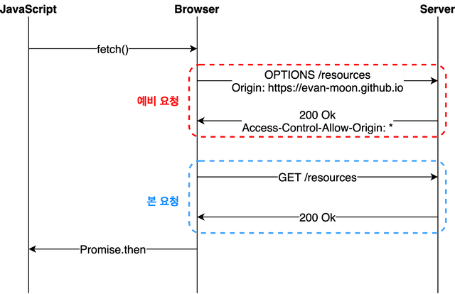

#CORS
## workflow


* 만약 공격자가 악성 스크립트코드가 포함된 웹사이트 주소를 희생자에게 보내 해당 스크립트를 실행하게 만들면 희생자는 쿠키로 저장된 세션키를 포함한 요청을 보내 희생자의 권한으로 다른 웹사이트의 리소스에 접근해서 공격자에게 해당 리소스를 보낼 수 있다. 이러한 일을 막기 위해 SOP(Same Origin Policy)가 생겼다. 하지만 이러한 SOP 때문에 다른 scheme(프로토콜), 주소, 포트에 있는 api에 접근할 수 없게 된다. 이러한 접근을 허용해 주기 위한 것이 CORS(Cross Origin Resource Sharing)이다.
* 사용자가 브라우저에서 다른 api서버에 요청을 하면 해당 api 서버는 헤더에 Access-Control-Allow-Origin 값을 보낸다. 만약 헤더에 사용자의 브라우저에서 실행한 웹사이트의 scheme(프로토콜), 주소, 포트번호와 일치하는 값이 존재하면 브라우저는 리소스를 요청한다. 반대로 일치하지 않으면 CORS에러를 띄운다.
## CORS 설정
### Spring Security
```java
@Configuration
public class SecurityConfig extends WebSecurityConfigurerAdapter {

    @Value("${origins}")
    private String origins;

    @Bean
    CorsConfigurationSource corsConfigurationSource() {
        CorsConfiguration corsConfiguration = new CorsConfiguration();
        // Access-Control-Allow-Origin 값을 설정한다.
        // setAllowedOrigins로 여러개를 한꺼번에 설정할 수 도 있다.
        corsConfiguration.addAllowedOrigin(origins); 
        // 어떤 HTTP 메서드를 허용할지 정할 수 있다.
        // setAllowedMethods로 여러개를 한꺼번에 설정할 수 있다.
        corsConfiguration.addAllowedMethod("*");
        // 허용할 헤더를 설정한다.
        corsConfiguration.addAllowedHeader("*");
        // 사용자 인증이 필요할 때 설정해줘야한다.
        // true면 브라우저에서 쿠키를 보내 사용자 인증이 필요한 리소스에 접근할 수 있다.
        corsConfiguration.setAllowCredentials(true);

        UrlBasedCorsConfigurationSource urlBasedCorsConfigurationSource = new UrlBasedCorsConfigurationSource();
        // 허용할 path 설정
        urlBasedCorsConfigurationSource.registerCorsConfiguration("/**", corsConfiguration);
        return urlBasedCorsConfigurationSource;
    }

    @Override
    protected void configure(HttpSecurity http) throws Exception {
        
        http.cors();
        
        ...

    }
}
```
### Spring Security 사용X
```java
@Configuration
public class CorsConfig implements WebMvcConfigurer {

    @Value("${origins}")
    private String origins;
    
    @Override
    public void addCorsMappings(CorsRegistry registry) {
        registry.addMapping("/**")
                .allowedOrigins(origins)
                .allowedMethods("*")
                .allowedHeaders("headers")
                .allowCredentials(true);
    }
}
```
* 스프링 시큐리티를 사용하지 않는다면 WebMvcConfigurer를 구현한 객체에서 CORS 정책을 설정할 수 있다.