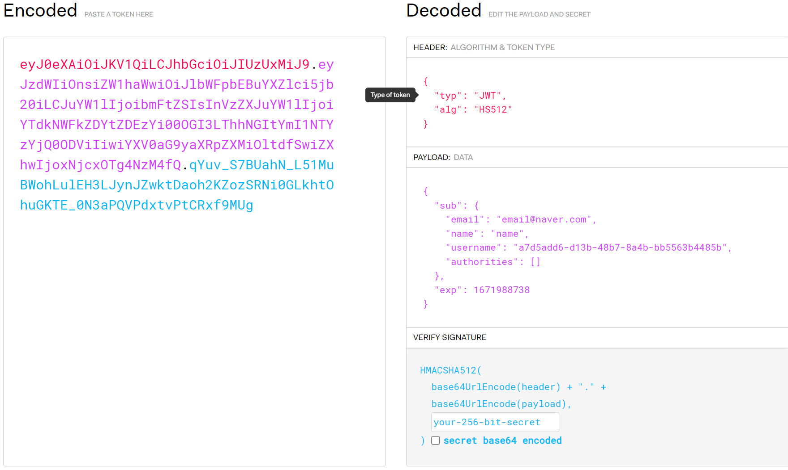

# JWT 기반 인증 처리
## 로그인 성공 시
### UserDetailsVo
```java
@Builder
@Getter
@NoArgsConstructor
@AllArgsConstructor
public class UserDetailsVo {

    private String email;

    private String name;

    private String username;

    private Collection<GrantedAuthority> authorities;
}
```
### AuthenticationFilter
```java
public class AuthenticationFilter extends UsernamePasswordAuthenticationFilter {

    @Override
    public Authentication attemptAuthentication(HttpServletRequest request,
                                                HttpServletResponse response) throws AuthenticationException {

        if (!request.getMethod().equals("POST")) {
            throw new AuthenticationServiceException("Authentication method not supported: " + request.getMethod());
        }
        try {
            RequestLogin creds = new ObjectMapper().readValue(request.getInputStream(), RequestLogin.class);

            return getAuthenticationManager().authenticate(
                    new UsernamePasswordAuthenticationToken(
                            creds.getEmail(),
                            creds.getPassword()));
        } catch (IOException e) {
            throw new RuntimeException(e);
        }
    }
}
```
* JSON 포맷으로 들어오는 아이디와 패스워드를 처리하기 위한 필터, x-www-form-urlencoded 포맷으로 보내면 원래 있는 UsernamePasswordAuthenticationFilter를 사용하면 됨
### Authentication
```java
@Getter
public class JsonAuthenticationToken extends AbstractAuthenticationToken {

    private static final long serialVersionUID = SpringSecurityCoreVersion.SERIAL_VERSION_UID;

    private final MemberContext memberContext;

    public JsonAuthenticationToken(MemberContext memberContext, Collection<? extends GrantedAuthority> authorities) {
        super(authorities);
        this.memberContext = memberContext;
        super.setAuthenticated(true); // must use super, as we override
    }

    @Override
    public Object getCredentials() {
        return this.memberContext.getEncryptedPwd();
    }

    @Override
    public Object getPrincipal() {
        return this.memberContext.getUsername();
    }

    @Override
    public void setAuthenticated(boolean isAuthenticated) throws IllegalArgumentException {
        Assert.isTrue(!isAuthenticated,
                "Cannot set this token to trusted - use constructor which takes a GrantedAuthority list instead");
        super.setAuthenticated(false);
    }

    @Override
    public void eraseCredentials() {
        super.eraseCredentials();
        this.memberContext.setEncryptedPwd(null);
    }
}
```
* 인증 성공 시 SecurityContextHolder에 위의 객체가 들어있어야 한다.
### UserDetailsService
```java
@RequiredArgsConstructor
public class UserDetailsServiceImpl implements UserDetailsService {

    private final UserRepository userRepository;

    @Override
    public UserDetails loadUserByUsername(String email) throws UsernameNotFoundException {
        Member member = userRepository.findByEmail(email).orElseThrow(() -> new UsernameNotFoundException("No such User"));
        return new MemberContext(member,
                true, true, true, true
                , new ArrayList<>());
    }
}
```
### AuthenticationProvider
```java
@RequiredArgsConstructor
public class JsonAuthenticationProvider implements AuthenticationProvider {

    private final UserDetailsService userDetailsService;

    private final PasswordEncoder passwordEncoder;

    @Override
    public Authentication authenticate(Authentication authentication) throws AuthenticationException {
        //authentication 에는 사용자가 입력한 아이디, 패스워드 정보가 들어있음
        String username = authentication.getName();
        String password = (String) authentication.getCredentials();

        MemberContext memberContext = (MemberContext) userDetailsService.loadUserByUsername(username);

        if (!passwordEncoder.matches(password, memberContext.getEncryptedPwd())) {
            throw new BadCredentialsException("Bad credential");
        }

        return new JsonAuthenticationToken(memberContext, memberContext.getAuthorities());
    }

    @Override
    public boolean supports(Class<?> authentication) {
        return UsernamePasswordAuthenticationToken.class.isAssignableFrom(authentication);
    }
}
```
### Security Configuration
```java
@EnableWebSecurity
@RequiredArgsConstructor
public class SecurityConfig {

    private final AuthenticationConfiguration authenticationConfiguration;

    private final UserRepository userRepository;

    private final Environment env;

    @Bean
    public SecurityFilterChain securityFilterChain(HttpSecurity http) throws Exception {
        http.csrf().disable();
        http.headers().frameOptions().disable();

        http.sessionManagement()
                .sessionCreationPolicy(SessionCreationPolicy.STATELESS); // 세션 방식 인증 안함

        http.authorizeHttpRequests()
                .antMatchers(HttpMethod.GET, "/users").authenticated()
                .anyRequest().permitAll();
        http
                .addFilterBefore(new JwtAuthenticationFilter(env), UsernamePasswordAuthenticationFilter.class)
                .addFilterBefore(getAuthenticationFilter(), UsernamePasswordAuthenticationFilter.class);
        return http.build();
    }

    @Bean
    public AuthenticationManager authenticationManager(AuthenticationConfiguration authenticationConfiguration)
            throws Exception {
        return authenticationConfiguration.getAuthenticationManager();
    }

    @Bean
    public UserDetailsService userDetailsService() {
        return new UserDetailsServiceImpl(userRepository);
    }

    @Bean
    public PasswordEncoder passwordEncoder() {
        return PasswordEncoderFactories.createDelegatingPasswordEncoder();
    }

    @Bean
    public AuthenticationProvider authenticationProvider() {
        return new JsonAuthenticationProvider(userDetailsService(), passwordEncoder());
    }

    private AuthenticationFilter getAuthenticationFilter() throws Exception {
        AuthenticationFilter authenticationFilter = new AuthenticationFilter();
        authenticationFilter.setAuthenticationManager(authenticationManager(authenticationConfiguration));
        authenticationFilter.setAuthenticationSuccessHandler((request, response, authentication) -> {
            response.setStatus(HttpServletResponse.SC_OK);
            long expiration = Long.parseLong(env.getProperty("token.expiration-time"));

            // 서명 알고리즘에 넣을 키 값 생성
            SecretKey key = Keys.hmacShaKeyFor(env.getProperty("token.secret").getBytes(StandardCharsets.UTF_8));

            JsonAuthenticationToken jsonAuthenticationToken = (JsonAuthenticationToken) authentication;
            MemberContext memberContext = jsonAuthenticationToken.getMemberContext();

            UserDetailsDto userDetailsDto = UserDetailsDto.builder()
                    .email(memberContext.getEmail())
                    .name(memberContext.getName())
                    .authorities(memberContext.getAuthorities())
                    .username(memberContext.getUsername())
                    .build();


            // jwt 토큰 생성
            String jwt = Jwts.builder()
                    .setHeaderParam("typ", "JWT") // 헤더에 typ라는 키로 값을 저장
                    .claim("sub", userDetailsDto) // claim에 sub라는 키로 값을 저장
//                    .setSubject((String) authentication.getPrincipal()) // 위와 같이 claim에 sub라는 키로 값을 저장
                    .setExpiration(new Date(System.currentTimeMillis() + expiration)) // 토큰 만료 시간(밀리초 단위)
                    .signWith(key, SignatureAlgorithm.HS512) // 서명 알고리즘
                    .compact();

            response.addHeader("JWT", jwt);
        });
        authenticationFilter.setAuthenticationFailureHandler((request, response, exception) -> {
            response.setStatus(HttpServletResponse.SC_UNAUTHORIZED);
        });
        return authenticationFilter;
    }
```
* 로그인 성공 시 response의 헤더에 JWT를 생성해 담는 AuthenticationSuccessHandler를 추가한다.
### 생성된 JWT


## JWT를 받았을 때
```java
@RequiredArgsConstructor
public class JwtAuthenticationFilter extends OncePerRequestFilter {

    private final ObjectMapper objectMapper = new ObjectMapper();

    private final Environment env;

    @Override
    protected void doFilterInternal(HttpServletRequest request, HttpServletResponse response, FilterChain filterChain) throws ServletException, IOException {

        String jwt = getJwtToken(request);
        if (jwt != null) {
            try {
                Map<String, Object> subject = parseSubject(jwt);
                UserDetailsVo userDetailsVo = objectMapper.convertValue(subject, UserDetailsVo.class);
                JsonAuthenticationToken jsonAuthenticationToken = new JsonAuthenticationToken(
                        new MemberContext(userDetailsVo,
                                true, true, true, true,
                                userDetailsVo.getAuthorities()),
                        userDetailsVo.getAuthorities()
                );

                SecurityContextHolder.getContext().setAuthentication(jsonAuthenticationToken);
            } catch (RuntimeException e) {
                response.setStatus(HttpServletResponse.SC_UNAUTHORIZED);
            }
        }
        filterChain.doFilter(request, response);
    }

    private Map<String, Object> parseSubject(String jwt) {
        Claims body = Jwts.parserBuilder()
                .setSigningKey(env.getProperty("token.secret").getBytes(StandardCharsets.UTF_8))
                .build()
                .parseClaimsJws(jwt)
                .getBody();

        // body.getSubject()로 하면 String으로 가져오는데 쌍따옴표가 없어서 objectMapper로 변환이 안됨
        Map<String, Object> subject = body.get("sub", LinkedHashMap.class);
        if (subject == null || subject.isEmpty()) {
            throw new RuntimeException("Unauthorized");
        }
        return subject;
    }

    private String getJwtToken(HttpServletRequest request) {
        String authorizationHeader = request.getHeader(HttpHeaders.AUTHORIZATION);
        if (authorizationHeader != null && authorizationHeader.startsWith("Bearer ")) {
            return authorizationHeader.replace("Bearer ", "");
        }
        return null;
    }
}
```
* 만약 헤더에 JWT가 있고 변조되지 않았다면 Authentication을 만들어 SecurityContextHolder에 넣어준다.
* 필터를 추가할 때는 AuthenticationFilter의 attemptAuthentication() 메서드가 동작하기 전에 SecurityContextHolder에 Authentication을 넣어줘야 하기 때문에 AuthenticationFilter 앞에 추가한다.
# API-Gateway 사용 시
## AuthorizationHeaderFilter
```java
@Component
@Slf4j
public class AuthorizationHeaderFilter extends AbstractGatewayFilterFactory<AuthorizationHeaderFilter.Config> {

    private final Environment env;

    public AuthorizationHeaderFilter(Environment env) {
        // 필수
        super(Config.class);
        this.env = env;
    }

    @Override
    public GatewayFilter apply(Config config) {

        // pre filter
        return ((exchange, chain) -> {
            ServerHttpRequest request = exchange.getRequest();

            if (!request.getHeaders().containsKey(HttpHeaders.AUTHORIZATION)) {
                return onError(exchange, "No authorization header", HttpStatus.UNAUTHORIZED);
            }

            String authorizationHeader = request.getHeaders().get(HttpHeaders.AUTHORIZATION).get(0);
            String jwt = authorizationHeader.replace("Bearer", "");

            if (!isValid(jwt)) {
                return onError(exchange, "Token is not valid", HttpStatus.UNAUTHORIZED);
            }

            // pre filter에 chaining 으로 post filter 가 추가됨
            return chain.filter(exchange);
        });
    }

    public static class Config {

    }

    private Mono<Void> onError(ServerWebExchange exchange, String errMessage, HttpStatus httpStatus) {
        ServerHttpResponse response = exchange.getResponse();
        response.setStatusCode(httpStatus);

        log.error(errMessage);

        return response.setComplete();
    }

    private boolean isValid(String jwt) {

        boolean result = true;

        String subject = null;

        try {
            Claims body = Jwts.parserBuilder()
                    .setSigningKey(env.getProperty("token.secret").getBytes(StandardCharsets.UTF_8))
                    .build()
                    // jwt의 종류로는 jws 와 jwe가 있는데 jws는 해시 알고리즘을 통해 서명한것 이다. 즉, 우리가 일반적으로 jwt라 일컬을 때 jws를 말한다.
                    // jwe 는 데이터를 암호화한 후 해시 알고리즘을 통해 서명하여 데이터 유출을 방지한 것이다.
                    .parseClaimsJws(jwt)
//                .getHeader()
//                .getSignature()
                    .getBody();
            subject = body.getSubject();
        } catch (Exception e) {
            result = false;
        }

        if (subject == null || subject.isEmpty()) {
            result = false;
        }

        return result;
    }
}
```
```yml
server:
  port: 8000

eureka:
  client:
    register-with-eureka: true
    fetch-registry: true
    service-url:
      default-zone: http://localhost:8761/eureka

spring:
  application:
    name: apigateway-service
  cloud:
    gateway:
      routes:
        
        # 인증이 필요 없는 서비스
        - id: catalog-service
          uri: lb://CATALOG-SERVICE
          predicates:
            - Path=/catalog-service/**
        - id: order-service
          uri: lb://ORDER-SERVICE
          predicates:
            - Path=/order-service/**
        - id: user-service # 여러 개로 나누기 가능
          uri: lb://USER-SERVICE
          predicates:
            - Path=/user-service/login
            - Method=POST # HTTP 메소드 지정
          filters:
            - RemoveRequestHeader=Cookie # HTTP 요청의 Cookie 헤더를 지워서 마이크로서비스로 보냄
            - RewritePath=/user-service/(?<segment>.*), /$\{segment} # api-gateway에 url이 /user-serivce/???로 들어오면 마이크로서비스로 /???로 url을 바꾸어 보냄
        - id: user-service
          uri: lb://USER-SERVICE
          predicates:
            - Path=/user-service/users
            - Method=POST
          filters:
            - RemoveRequestHeader=Cookie
            - RewritePath=/user-service/(?<segment>.*), /$\{segment}

        # 인증이 필요한 서비스
        - id: user-service
          uri: lb://USER-SERVICE
          predicates:
            - Path=/user-service/**
            - Method=GET
          filters:
            - RemoveRequestHeader=Cookie
            - RewritePath=/user-service/(?<segment>.*), /$\{segment}
            - AuthorizationHeaderFilter

token:
  secret: FOJ2@#FJ33TF@#5Ffom#!@3@kkf2#$2FF234f2#gmFOJ2@#FJ33TF@#5Ffom#!@3@kkf2#$2FF234f2#gm
```
* JWT는 헤더에 `"Authorization" : "Bearer (JWT 토큰 값)"`의 형식으로 들어온다. 따라서 JWT 값을 얻을 때는 앞의 Bearer라는 글자를 없애야한다.
* 만약 인증이 필요한 서비스에 JWT 없이 요청이 들어오면 API-Gateway 단에서 Unauthorized로 응답을 보낸다.
* 인증이 필요하지 않은 서비스일 경우에는 해당 필터를 거치지 않도록 한다.