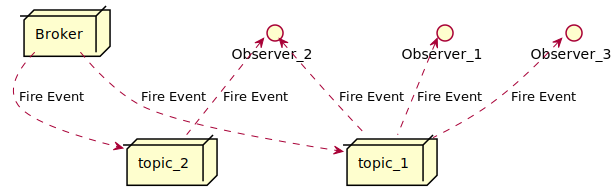
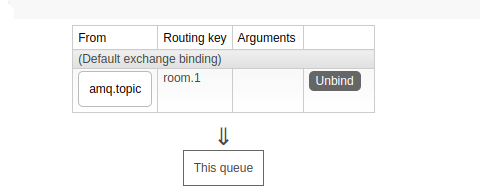

# 메세지 브로커
## 메세지 브로커란


* 메세지 브로커는 Publish-subscribe 패턴을 통해 클라이언트에게 메세지를 내려보내는 미들웨어이다.
* 클라이언트는 토픽별로 구독을 하고 서버는 해당 토픽을 destination으로 하는 메세지를 브로커에게 쏘기만 한다. 그러면 브로커는 토픽 단위로 메세지 스트림을 내려보내고 해당 토픽을 구독하고 있는 각각의 클라이언트는 메세지를 받게 된다.
## MQTT
* MQTT는 Publish-subscribe 기반의 메세지 발행 프로토콜이다.
* MQTT에는 QoS 라는게 있는데 QoS란 서비스의 질을 보장해주는 레벨을 의미한다.

### QoS 0 : At most once(fire and forgot)


* QoS 0 에서는 메세지를 보내고 메세지 브로커는 해당 메세지를 저장하지 않는다. 따라서 한번에 전송이 성공하지 않으면 전송은 실패하게 된다.
### QoS 1 : At least once


* QoS 1은 메세지가 최소 한번은 가는 것을 보장한다. 하지만 메세지가 두 번 이상 갈 수도 있다.
* 메세지가 두 번 이상 가는 경우
  1. 퍼블리셔가 브로커에게 메세지를 내려보낸다.
  2. 브로커는 받은 메세지를 저장해 두고 클라이언트에게 정상적으로 보낸다.
  3. 브로커는 메세지를 보냈으므로 저장해둔 메세지를 삭제하고 puback을 퍼블리셔에게 보낸다.
  4. puback이 전달 중 소실 된다.
  5. 퍼블리셔는 puback을 기다리다가 시간이 지나서 전송이 실패한 것으로 판단하고 다시 브로커에게 같은 메세지를 보낸다.
  6. 브로커는 메세지에 관한 정보를 삭제했기 때문에 클라이언트에게 보낼 새로운 메세지인줄 알고 다시 클라이언트에게 같은 메세지를 보낸다.
  7. 브로커는 다시 puback을 보내고 퍼블리셔가 puback을 받은 후 통신은 정상 종료된다.
### QoS 2 : Exactly once


* QoS 2는 puback 과정을 3-way-handshaking 으로 바꿈으로써 메세지가 정확히 한 번만 가도록 구현한 레벨이다.
* 브로커가 메세지 전송에 성공하면 저장해둔 메세지 정보를 삭제하는 대신에 puback을 보낸 후 퍼블리셔에게 pubrec(pub received)을 받으면 그 때 메세지 정보를 삭제한다. 따라서 만약 퍼블리셔가 puback을 받지 않아 다시 메세지를 내려보내도 해당 메세지 정보를 브로커가 저장하고 있기 때문에 같은 다시 메세지를 클라이언트에게 보내지 않게 된다.
## AMQP


* AMQP는 Exchange, Queue, Binding 이라는 3가지 요소로 이루어진 프로토콜이다.
* Exchange는 publisher 로 부터 받은 메세지를 분배하는 라우터의 역할을 한다. Queue는 메세지를 저장하고 consumer에 전달하는 역할을 한다. 그리고 Binding은 어떤 메세지를 어떤 Queue에 전달할 지 결정하는 라우팅 테이블의 역할을 한다.
### Direct Exchange


* 라우팅 테이블의 이름과 동일한 Queue의 이름에 메세지를 전달하는 방법이다.
### Topic Exchange


* 라우팅 키는 `.`으로 구분된 단어의 집합이 되고, Queue의 이름은 와일드 카드를 이용하여 라우팅 키가 해당 Queue의 이름에 매칭이 된다면 메세지를 Queue에 전달하는 방법이다.
### Fanout Exchange


* 모든 메세지를 모든 Queue로 라우팅 하는 방법이다.

### Header Exchange


* key, value로 정의된 헤더에 의해 라우팅을 결정한다. Queue를 바인딩 할 때 x-match가 all 이면 바인딩 조건을 모두 충족시켜야 하고, x-match가 any면 바인딩 조건 중 하나만 충족시켜도 된다.
## RabbitMQ
```java
@Configuration
@EnableWebSocketMessageBroker
@RequiredArgsConstructor
public class WebSocketConfig implements WebSocketMessageBrokerConfigurer {

    @Value("${origins}")
    private String origins;

    @Override
    public void registerStompEndpoints(StompEndpointRegistry registry) {
        registry.addEndpoint("/stomp")
                .setAllowedOrigins(origins)
                .withSockJS();
    }

    @Override
    public void configureMessageBroker(MessageBrokerRegistry registry) {
        registry
                .setPathMatcher(new AntPathMatcher("."))
                .setApplicationDestinationPrefixes("/chat")
                .enableStompBrokerRelay("/queue", "/topic", "/exchange", "/amq/queue")
                .setRelayHost("localhost")
                .setRelayPort(61613)
                .setClientLogin("guest")
                .setClientPasscode("guest");
    }
}
```
```java
@Component
@Slf4j
public class MessageListenerLog implements MessageListener {

    @Override
    public void onMessage(Message message) {
        log.info("received message : {}", message);
    }
}
```
```java
@Configuration
@RequiredArgsConstructor
public class RabbitConfig {

    private static final String chatQueueName = "chat.queue";

    private static final String chatExchangeName = "chat.exchange";

    private static final String routingKey = "room.*";

    private final MessageListener messageListener;

    //Queue 등록
    @Bean
    public Queue queue(){
        return new Queue(chatQueueName, true);
    }

    //Exchange 등록
    @Bean
    public TopicExchange exchange(){
        return new TopicExchange(chatExchangeName);
    }

    //Exchange 와 Queue 바인딩
    @Bean
    public Binding binding(Queue queue, TopicExchange exchange) {
        return BindingBuilder.bind(queue).to(exchange).with(routingKey);
    }

    @Bean
    public RabbitTemplate rabbitTemplate(){
        RabbitTemplate rabbitTemplate = new RabbitTemplate(connectionFactory());
        rabbitTemplate.setMessageConverter(jsonMessageConverter()); // 객체 전달 시 필요
        return rabbitTemplate;
    }

    // 여러 큐의 메세지를 받아와야하는 메세지 리스너는 MessageListenerContainer 를 통해 등록하는 것이 좋다.
    @Bean
    public SimpleMessageListenerContainer container(){
        SimpleMessageListenerContainer container = new SimpleMessageListenerContainer();
        container.setConnectionFactory(connectionFactory()); // connectionFactory 의 설정대로 rabbitmq 와 연결됨
        container.setQueueNames(chatQueueName); // 메세지 리스너가 해당하는 큐를 listen 함, 여러 큐 지정 가능
        container.setMessageListener(messageListener); // 메세지 리스너 등록
        return container;
    }

    @Bean
    public ConnectionFactory connectionFactory(){
        CachingConnectionFactory factory = new CachingConnectionFactory();
        factory.setHost("localhost");
        factory.setUsername("guest");
        factory.setPassword("guest");
        return factory;
    }

    @Bean
    public Jackson2JsonMessageConverter jsonMessageConverter(){
        return new Jackson2JsonMessageConverter();
    }
}
```
* STOMP destination
  

  1. __/exchange__ : /exchange/{exchange_name}/{routing_key} {exchange_name}으로 subscribe frame을 보낸다. 새로 큐를 생성하며 {routing_key}로 바인딩 된다. `/exchange/chat.exchange/room.1`로 subscribe frame 을 보내면 새로 큐가 생성되면서 위와 같이 exchange와 routing key가 바인딩 된다.
  
  

  2. __/queue__ : /queue/{queue_name} 으로 subscribe frame을 보낸다. 현재 rabbiMQ가 관리하는 큐에 대해 subscribe를 하고 큐를 새로 생성하지는 않는다. exchange는 default exchange를 사용한다. `/queue/chat.queue`로 subscribe frame을 보내면 위의 이미지 처럼 큐가 새로 생성되지 않고 이미 존재하는 queue였던 chat.queue를 subscribe하게 된다.

  

  3. __/topic__ : /topic/{routing_key} 으로 subscribe frame을 보낸다. 큐를 새로 생성하며 exchange는 amq.topic을 사용하고 {routing_key}로 바인딩 된다. 위의 이미지는 `/topic/room.1`로 subscribe frame을 보냈다.
  4. __/amq/queue__ : /amq/queue/{queue_name} 으로 subscribe frame을 보낸다. 돌려보니깐 /queue/{queue_name}랑 똑같이 동작한다. 레퍼런스를 보니깐 STOMP gateway 바깥에서 만들어진 queue를 구독한다는 걸 보니 /queue/{queue_name}의 경우에는 서버에서 직접 만들어진 queue를 구독할 때 쓰는 것 같고, /amq/queue/{queue_name}는 서버 외부에서 만들어진 queue(위의 /topic 이나 /exchange 같은걸로 만들어진거)를 구독할 때 쓰이는 것 같다.