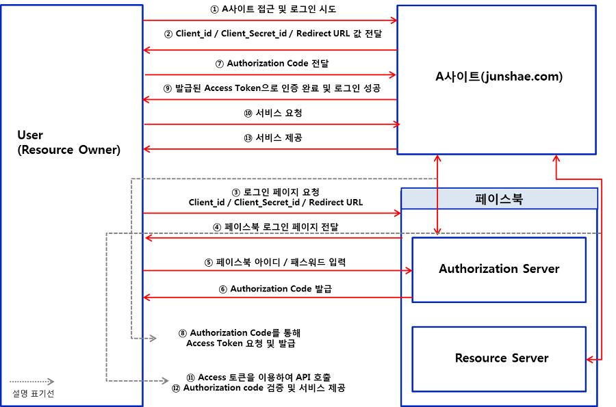

# OAuth
## Workflow


1. 사용자가 웹사이트(클라이언트)에 OAuth 로그인을 시도한다.
2. 클라이언트는 OAuth 로그인페이지로 리다이렉트한다.
3. 사용자가 로그인페이지를 통해 로그인을 하면 authorization 서버는 사용자에게 authorization code를 발급한다.
4. 사용자는 발급받은 authorization code를 클라이언트에게 전달한다.
5. 클라이언트는 사용자로부터 받은 authorization code를 client id와 client secret과 함께 authorization 서버에 전달해 access token을 발급받는다.
6. 만약 사용자가 클라이언트에게 어떤 서비스를 요청하면 클라이언트는 발급받은 access token을 가지고 resource 서버의 api를 통해 해당 사용자의 권한으로 리소스에 접근할 수 있다.
## 구현
```yml
spring:
    security:
        oauth2:
        client:
            registration:
            google: //어느 리소스 서버인지
                clientId: 클라이언트 아이디
                clientSecret: 클라이언트 시크릿
                scope: # 클라이언트에게 허용된 리소스의 범위
                - email
                - profile
            naver:
            clientId: 클라이언트 아이디
            clientSecret: 클라이언트 시크릿
            scope:
              - name
              - email
            clientName: Naver
            authorizationGrantType: authorization_code # oauth grant type
            redirectUri: http://localhost:8080/login/oauth2/code/naver # 네이버는 oauth-client가 제공하는 provider가 아니기 때문에 이걸 적어줘야한다
        provider:
          naver:
            authorizationUri: https://nid.naver.com/oauth2.0/authorize # 네이버 로그인 창
            tokenUri: https://nid.naver.com/oauth2.0/token # 토큰 발급 uri
            userInfoUri: https://openapi.naver.com/v1/nid/me # 프로필 접근 uri
            userNameAttribute: response # naver 에서 사용자 정보를 response 라는 키값에 넣어서 보내준다
```
```java
@Configuration
@RequiredArgsConstructor
public class SecurityConfig extends WebSecurityConfigurerAdapter {

    private final PrincipalOauth2UserService principalOauth2UserService;

    @Value("${baseUrl}")
    private String loginSuccessUrl;

    @Override
    protected void configure(HttpSecurity http) throws Exception {
        http.authorizeRequests()
                .anyRequest().permitAll();
        http.headers()
                .frameOptions()
                .sameOrigin();
        http.oauth2Login() // 이걸 설정해야 /oauth2/authorization/google 로 요청을 받았을 때 구글로 로그인 하도록 리다이렉트함
                .loginPage("/login")
                .defaultSuccessUrl(loginSuccessUrl)
                .userInfoEndpoint() // 필수
                .userService(principalOauth2UserService); //파라미터로 들어가는 객체는 OAuth2UserService를 구현한 객체이다. 해당 객체에는 access 토큰을 받은 후 처리할 로직이 들어있다.
    }
}
```
```java
// provider에 따라 attributes로 들어오는 값이 다르기 때문에 인터페이스를 만들어 주는 것이 좋다.
public interface OAuthUserInfo {

    String getProviderId();

    String getProvider();

    String getEmail();

    String getName();

    Map<String, Object> getAttributes();
}
```
```java
@RequiredArgsConstructor
public class GoogleOAuthUserInfo implements OAuthUserInfo{

    private final Map<String, Object> attributes;

    @Override
    public String getProviderId() {
        return (String) attributes.get("sub");
    }

    @Override
    public String getProvider() {
        return "google";
    }

    @Override
    public String getEmail() {
        return (String) attributes.get("email");
    }

    @Override
    public String getName() {
        return (String) attributes.get("given_name");
    }

    @Override
    public Map<String, Object> getAttributes() {
        return this.attributes;
    }
}
```
```java
@RequiredArgsConstructor
public class NaverOAuthUserInfo implements OAuthUserInfo{

    private final Map<String, Object> attributes;

    @Override
    public String getProviderId() {
        return (String) attributes.get("id");
    }

    @Override
    public String getProvider() {
        return "naver";
    }

    @Override
    public String getEmail() {
        return (String) attributes.get("email");
    }

    @Override
    public String getName() {
        return (String) attributes.get("name");
    }

    @Override
    public Map<String, Object> getAttributes() {
        return this.attributes;
    }
}

```
```java
// 일반 폼 로그인에서는 UserDetails를 구현한 객체를 SecurityContextHolder에서 principal로 가지고있지만 OAuth를 사용하면 OAuth2User를 구현한 객체를 갖는다. 만약 OAuth와 폼 로그인 둘 다 사용하려면 둘다 구현하면 된다.
@RequiredArgsConstructor
public class MemberDetails implements OAuth2User {

    private final Member member;

    private final OAuthUserInfo oAuthUserInfo;

    // 유저 정보 리턴
    @Override
    public Map<String, Object> getAttributes() {
        return oAuthUserInfo.getAttributes();
    }

    //해당 유저의 권한을 리턴
    @Override
    public Collection<? extends GrantedAuthority> getAuthorities() {
        List<GrantedAuthority> roles = new ArrayList<>();
        roles.add(new SimpleGrantedAuthority(member.getRole().getDescription()));
        return roles;
    }

    //sub값 리턴
    @Override
    public String getName() {
        return oAuthUserInfo.getProviderId();
    }

    public String getUsername() {
        return member.getUsername();
    }

    public String getNickname() {
        return member.getNickname();
    }

    public String getEmail() {
        return member.getEmail();
    }
}
```
```java
//액세스 토큰을 받기까지의 과정을 oauth2-client 가 전부 자동화해준다.
//여기에서는 authorization server 로 부터 받은 액세스 토큰과 유저 정보를 다룬다.
@Service
@RequiredArgsConstructor
@Transactional
@Slf4j
public class PrincipalOauth2UserService extends DefaultOAuth2UserService {

    private final PasswordEncoder passwordEncoder;
    private final MemberRepository memberRepository;

    //userRequest 에는 authorization server 로 부터 받은 유저정보 뿐만 아니라 어느 authorization server 로 부터 받았는지(getClientRegistration())에 대한 정보도 들어있다.
    //access token을 받은 후 로직을 작성할 수 있다.
    @Override
    public OAuth2User loadUser(OAuth2UserRequest userRequest) throws OAuth2AuthenticationException {

        OAuth2User oAuth2User = super.loadUser(userRequest);
        OAuthUserInfo oAuthUserInfo = null;

        String provider = userRequest.getClientRegistration().getRegistrationId();

        if (provider.equals("google")) {
            oAuthUserInfo = new GoogleOAuthUserInfo(oAuth2User.getAttributes());
        } else if (provider.equals("naver")) {
            oAuthUserInfo = new NaverOAuthUserInfo((Map<String, Object>) oAuth2User.getAttribute("response"));
        }
        String providerId = oAuthUserInfo.getProviderId();
        String email = oAuthUserInfo.getEmail();
        String nickname = oAuthUserInfo.getName();
        String username = provider + "_" + providerId;
        String password = "ocj5df!983@5f";

        Optional<Member> byUsername = memberRepository.findByUsername(username);

        Member member;

        if (byUsername.isEmpty()) {
            member = new Member(username, password, email, nickname, Role.USER, passwordEncoder);
            memberRepository.save(member);
        } else {
            member = byUsername.get();
        }

        MemberDetails memberDetails = new MemberDetails(member, oAuthUserInfo);

        return memberDetails;
    }
}
```
```java
// @AuthenticationPrincipal을 사용하면 SecurityContextHolder에 들어있는 principal을 가져올 수 있다. 이 때 해당 유저가 OAuth로 로그인 했으면 OAuth2User를 받고, 폼 로그인으로 로그인했으면 UserDetails를 받는다.
@GetMapping("/")
public String index(@AuthenticationPrincipal MemberDetails memberDetails) {

    ...

}
```
* 스프링은 spring oauth-client를 사용하면 위의 workflow의 1에서 5까지의 과정을 전부 자동화해준다. 나는 access token을 받은 후의 로직과 인증된 사용자에대한 로직만 짜면 된다.
* spring oauth-client에 구글이나 페이스북 같은 것들은 provider로 등록이 되어있지만 네이버나 카카오같은 것들은 provider로 등록이 되어있지 않다. 따라서 oauth 설정 시 부가적인 것들을 좀 더 설정해줘야 한다.
