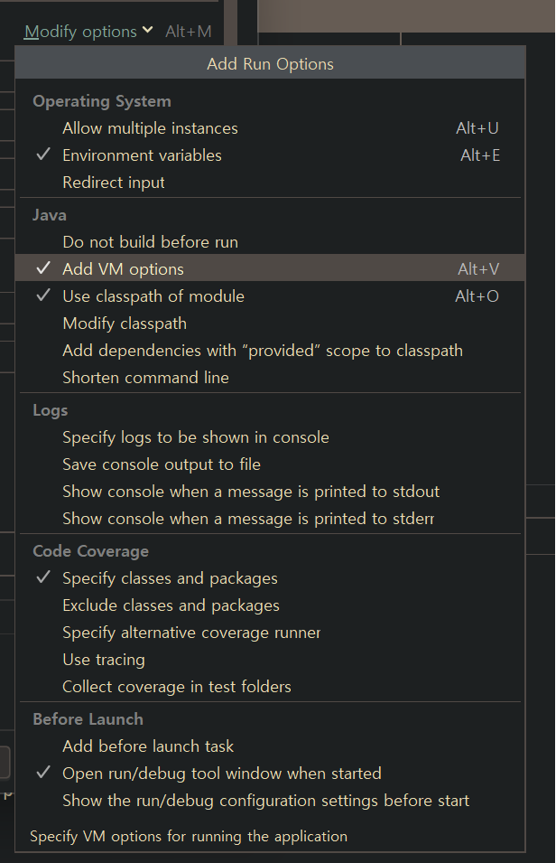
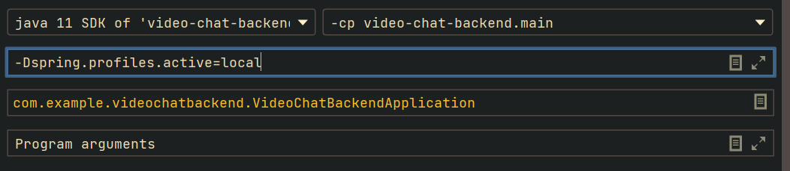

# 프로파일
## 프로파일 사용
```yml
spring:
    profiles:
        group:
            local: # 로컬 환경
                - common
                - local_db
                - local_rabbitMQ
            prod: # 배포 환경
                - common
                - prod_db
                - prod_rabbitMQ

---

# 공통부분
spring:
    config:
        activate:
            on-profile: "common"

server:
    port: 8080

---

spring:
    config:
        activate:
            on-profile: "local_db"
    datasource:
        url: jdbc:mysql://localhost:3306/local?serverTimezone=UTC&characterEncoding=UTF-8
        username: local
        password: local
        driver-class-name: com.mysql.cj.jdbc.Driver

---

spring:
    config:
        activate:
            on-profile: "prod_db"
    datasource:
        url: jdbc:mysql://localhost:3306/prod?serverTimezone=UTC&characterEncoding=UTF-8
        username: prod
        password: prod
        driver-class-name: com.mysql.cj.jdbc.Driver

---

# 직접 만든 변수값도 profile 설정 가능
spring:
    config:
        activate:
            on-profile: "local_rabbitMQ"

username: local
password: local

---

spring:
    config:
        activate:
            on-profile: "local_rabbitMQ"

username: prod
password: prod
```
```java
@Slf4j
@Profile("local") // 프로파일 이름 혹은 프로파일 그룹 이름이 들어감
@Component
public class Local {

    @PostConstruct
    public void execute() {
        log.info("local 프로파일 사용시만 스프링 빈으로 등록됨")
    }

    ...

}
```
* yml 파일 내에서 구분자 '---'를 사용하여 profile을 나누어 환경별로 설정을 다르게 가져갈 수 있다.
* 자바 코드에도 @Profile 어노테이션을 사용하여 특정 프로파일에서만 해당 클래스를 스프링 빈에 등록한다. 보통은 설정파일을 프로파일별로 다르게 가져갈 때 사용하기 때문에 @Configuration 위에 사용하는 경우가 많다.
## 프로파일 실행
### 인텔리제이에서 실행
1. 재생버튼 왼쪽에 edit configuration에 들어간다.


2. add vm options를 클릭해 vm option을 넣을 수 있게 해준다.


3. 위의 옵션을 넣어준다. 값은 원하는 프로파일 그룹 이름을 넣는다.
4. 재생버튼 눌러서 실행
### jar 파일 실행
```
java -jar -Dspring.profiles.active=local [jar_name].jar
```