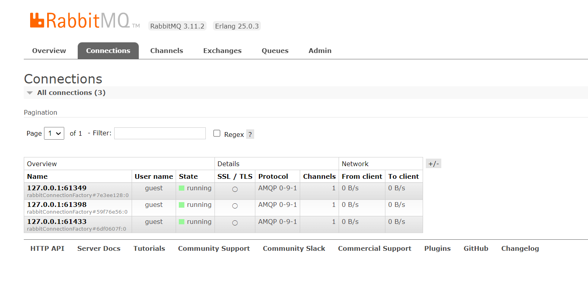
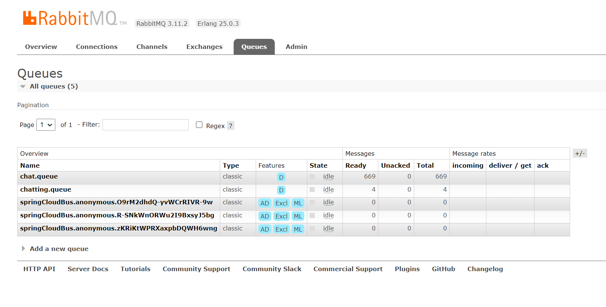
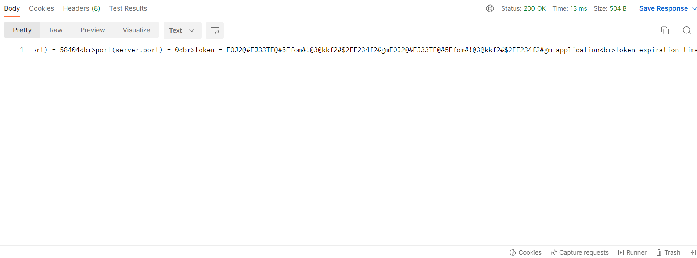
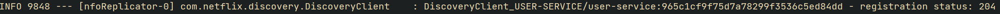
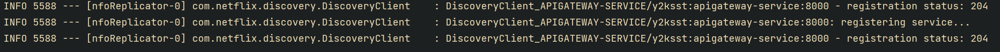
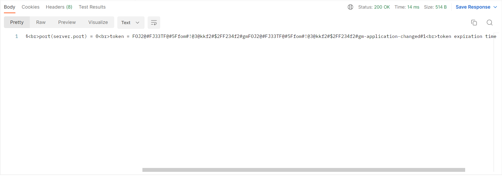
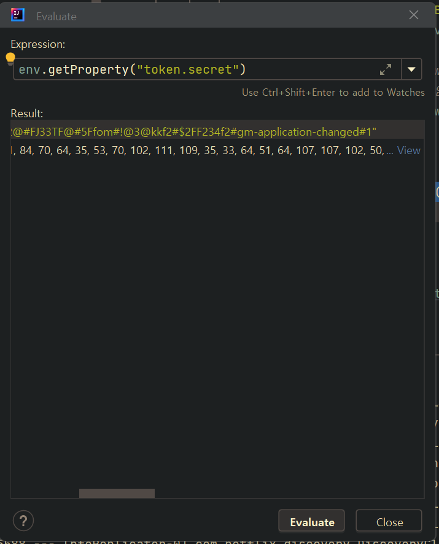

# Spring Cloud Bus
## 세팅
```gradle
implementation 'org.springframework.boot:spring-boot-starter-actuator'
implementation 'org.springframework.cloud:spring-cloud-starter-bus-amqp'
implementation 'org.springframework.cloud:spring-cloud-starter-bootstrap'
```
* spring cloud bus를 사용하기 위해서는 위의 3개의 의존성을 설정해줘야한다.
* actuator는 spring cloud bus가 actuator의 busrefresh 기능을 사용하기 때문에 추가해 준다.
* amqp는 spring cloud bus를 rabbitMQ를 사용하여 구성하기 위해 추가한다.
* bootstrap.yml 파일은 application.yml 파일과 다르게 자동으로 로딩이 되지 않는다. 따라서 bootstrap.yml 파일을 자동으로 로딩시켜 주기위해 bootstrap 을 의존성에 추가시켜준다.
```yml
# configuration server의 application.yml 파일
server:
  port: 8888

spring:
  application:
    name: config-server
  # rabbitmq를 통해 spring cloud bus를 사용하기 위한 설정값
  # ----------------------------------------------------------------
  rabbitmq:
    host: 127.0.0.1 # localhost로 넣으면 안된다.
    port: 5672
    username: guest
    password: guest
  # ---------------------------------------------------------------- 
#  profiles:
#    active: native # native(git 사용X)로 사용하고 싶으면 넣어줘야한다.
  cloud:
    config:
      server:
#        native:
#          search-locations: file:///${user.home}/OneDrive/Desktop/native-file-repo # 깃으로 관리 안해도됨
        git:
          default-label: master # 깃허브 default 브랜치 이름이 main이 아닐 때 적어주자
#          uri: file:///C:/spring_cloud/git-local-repo
          uri: https://github.com/dlwldyd/git-local-repo.git
#          username: {username} private repo 사용 시 깃허브 아이디와 패스워드를 넣어줘야한다.
#          password: {password}

# actuator에 busrefresh 기능 추가
# ----------------------------------------------------------------
management:
  endpoints:
    web:
      exposure:
        include: health, busrefresh
# ----------------------------------------------------------------        
```
* rabbitMQ를 사용하기 위한 설정값을 넣는다.
* actuator에 busrefresh 설정을 추가한다.
* 나머지 마이크로서비스에도 rabbitMQ를 사용하기 위한 설정값과 busrefresh 설정만 똑같이 추가해 주변 된다.



* rabbitMQ 설정값을 추가해주면 해당 마이크로서비스들이 rabbitMQ의 클라이언트가 된다.
## 사용


* 기존 설정값은 토큰의 마지막이 application으로 끝난다.
* 여기서 http://localhost:8000/user-service/actuator/busrefresh에 POST로 요청을 보낸다.





* 요청을 보내면 204응답이 오고, user-service와 api-gateway의 로그를 보면 위와 같은 로그가 남은 것을 볼 수 있다.




* user-service 뿐만 아니라 api-gateway 또한 busrefresh 요청을 보내지 않았음에도 설정값이 바뀌어 있는 것을 볼 수 있다.
* 이처럼 cloud bus를 사용하면 하나의 마이크로서비스에서 busrefresh 요청이 들어오면 다른 마이크로 서비스에 푸시해서 설정 값이 바뀐 다는 것을 알려주기 때문에 한 번만 busrefresh 요청을 보내면 된다.(refresh를 사용하면 마이크로서비스마다 일일이 요청을 보내야한다.)