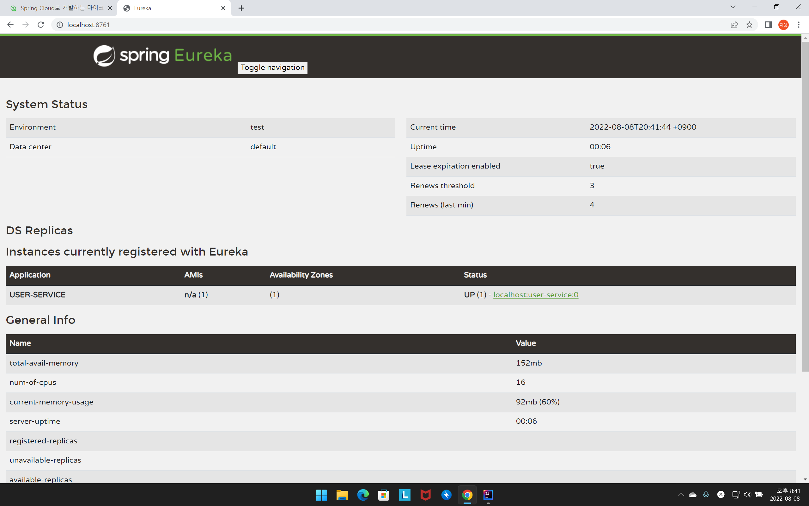
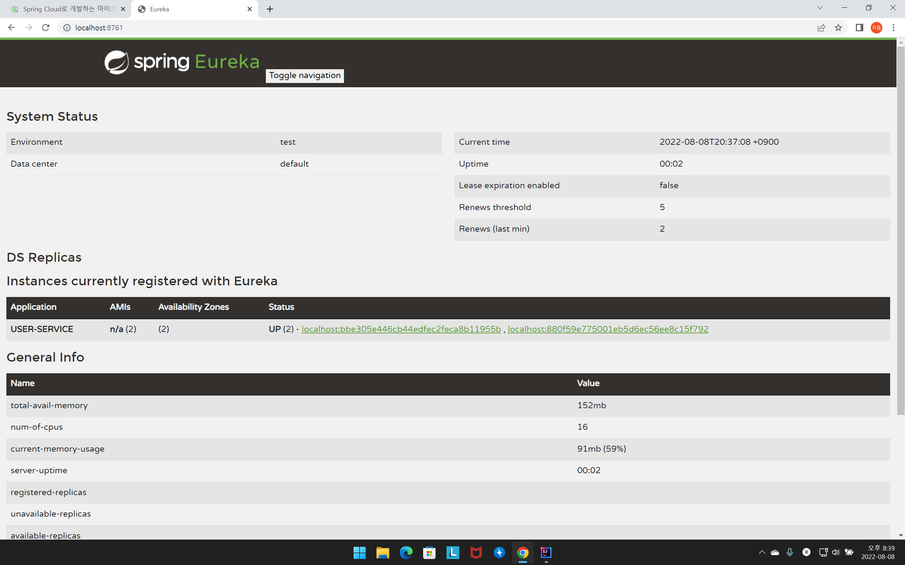

# 넷플릭스 유레카
## 넷플릭스 유레카 설정
```yml
server:
  port: 8761

spring:
  application:
    name: discoveryservice # 마이크로서비스의 이름을 등록

eureka:
  client:
    register-with-eureka: false # eureka server 에 자기 자신(eureka server)을 등록하지 않음
    fetch-registry: false
```
* 넷플릭스 유레카가 자기 자신을 서비스로 등록하면 안되기 때문에 `register-with-eureka: false`로 설정한다.
## 서비스 등록 시
```yml
# microservice1
server:
  port: 8001 # 특정 포트 사용

spring:
  application:
    name: user-service

  client:
    register-with-eureka: true # eureka server 에 클라이언트로 등록
    fetch-registry: true # eureka server 로부터 인스턴스들의 정보를 주기적으로 가져옴(캐시를 사용하지 않고 갱신된 정보를 가져옴)
    service-url:
      defaultZone: http://localhost:8761/eureka # eureka server 에 서비스의 url 등록함
```
```yml
# microservice2
server:
  port: 0 # 랜덤 포트 사용

spring:
  application:
    name: user-service

eureka:
  client:
    register-with-eureka: true # eureka server 에 클라이언트로 등록
    fetch-registry: true # eureka server 로부터 인스턴스들의 정보를 주기적으로 가져옴(캐시를 사용하지 않고 갱신된 정보를 가져옴)
    service-url:
      defaultZone: http://localhost:8761/eureka # eureka server 에 서비스의 url 등록함
```
* 다른 마이크로 서비스를 넷플릭스 유레카에 등록할 때 포트번호를 0으로 설정하면 랜덤 포트를 사용할 수 있다.
* 만약 부하 분산을 위해 하나의 서비스를 여러 인스턴스를 실행하려면 특정 포트를 사용하기 보다는 랜덤 포트를 사용하는 것이 더 좋을 것이다. 왜냐하면 특정 포트를 사용한다면 인스턴스마다 어떤 포트를 사용할 지 설정해줘야 하기 때문이다.
## 하나의 서비스를 여러 인스턴스로 실행할 때
### 인스턴스 이름 등록X


```yml
server:
  port: 0 # 랜덤 포트 사용

spring:
  application:
    name: user-service

eureka:
  client:
    register-with-eureka: true # eureka server 에 클라이언트로 등록
    fetch-registry: true # eureka server 로부터 인스턴스들의 정보를 주기적으로 가져옴(캐시를 사용하지 않고 갱신된 정보를 가져옴)
    service-url:
      defaultZone: http://localhost:8761/eureka # eureka server 에 서비스의 url 등록함
```
* 인스턴스의 이름을 등록하지 않으면 각 인스턴스를 구분할 수 가 없다.(인스턴스가 하나인걸로 나옴)
### 인스턴스 이름 등록O


```yml
server:
  port: 0 # 랜덤 포트 사용

spring:
  application:
    name: user-service

eureka:
  instance:
    instance-id: ${spring.cloud.client.hostname}:${spring.application.instance_id:${random.value}} # 인스턴스 id 등록
  client:
    register-with-eureka: true # eureka server 에 클라이언트로 등록
    fetch-registry: true # eureka server 로부터 인스턴스들의 정보를 주기적으로 가져옴(캐시를 사용하지 않고 갱신된 정보를 가져옴)
    service-url:
      defaultZone: http://localhost:8761/eureka # eureka server 에 서비스의 url 등록함
```
* 인스턴스 이름을 등록하면 각 인스턴스를 구분할 수 있다.