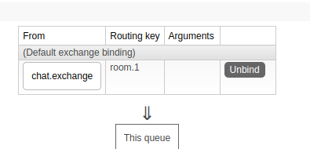
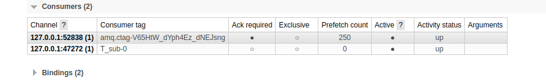
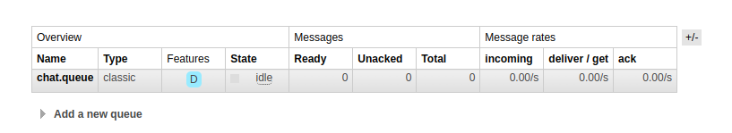

# STOMP
## simple broker 사용 시 work flow


```java
@Configuration
@EnableWebSocketMessageBroker
@RequiredArgsConstructor
public class WebSocketConfig implements WebSocketMessageBrokerConfigurer {

    @Value("${origins}")
    private String origins;

    @Override
    public void registerStompEndpoints(StompEndpointRegistry registry) {
        // SockJS을 연결할 endpoint url
        registry.addEndpoint("/stomp")
                .setAllowedOrigins(origins)
                .withSockJS();
    } 

    @Override
    public void configureMessageBroker(MessageBrokerRegistry registry) {
        // 클라이언트가 메세지를 보낼 때의 url prefix
        registry.setApplicationDestinationPrefixes("/chat")
        // 클라이언트가 subscribe 할 때 붙는 url prefix
        // 메세지 브로커는 url처럼 이름이 붙는데 메세지 브로커 이름이 subs라 보면 된다.
                .enableSimpleBroker("/subs");
    }
}
```
* WebSocketMessageBrokerConfigurer를 구현하여 STOMP를 사용할 수 있는데 registerStompEndpoints()의 addEndpoint()를 통해 어느 url로 SockJS를 연결할 지 정하고, configureMessageBroker()의 setApplicationDestinationPrefixes()를 통해 클라이언트가 메세지를 보낼 때의 url prefix와 enableSimpleBroker()를 통해 메세지 브로커의 이름을 정한다.
```java
@Controller
public class ChatController {

    private final SimpMessagingTemplate template;

    // topic
    @MessageMapping("/room")
    // /subs 메세지 브로커에 room 토픽으로 메세지를 내림
    // 메세지가 들어올 때는 /chat/room으로 들어오지만 메세지 브로커에는 /subs/room으로 메세지를 내린다.(정확히는 브로커 채널에)
    @SendTo("/subs/room")
    public String message(String msg) {
        // template.convertAndSend(chatExchangeName, "room." + roomId, msg);
        return msg;
    }
}
```
```typescript
import { useEffect, useRef, useState } from "react";
import SockJS from "sockjs-client";
import Stomp from "stompjs";

function ChatForm() {
    const stomp = useRef<Stomp.Client>();
    const [receivedMsg, setReceivedMsg] = useState<string[]>([]);
    const [msg, setMsg] = useState("");
    useEffect(() => {
        const ws = new SockJS("http://localhost:8080/stomp");
        stomp.current = Stomp.over(ws);
        stomp.current.connect({}, () => {
            // /subs/ 브로커의 room 토픽을 susbscribe
            stomp.current?.subscribe("/subs/room", (message) => {
                setReceivedMsg(receivedMsg => [message.body, ...receivedMsg]);
            });
        });
        return () => {
            stomp.current?.disconnect(() => {});
        }
    }, []);
    const onSubmit = (event: React.FormEvent<HTMLFormElement>) => {
        event.preventDefault();
        // 메세지는 /chat/room 으로 보낸다.
        stomp.current?.send("/chat/room", {}, msg);
        setMsg("");
    }
    const onChange = (event: React.ChangeEvent<HTMLInputElement>) => {
        setMsg(event.target.value);
    }

    return (
        <div>
            <ul>
                {receivedMsg.map((msg, idx) => <li key={idx}>{msg}</li>)}
            </ul>
            <form onSubmit={onSubmit}>
                <input type="text" placeholder='메세지 입력' onChange={onChange} value={msg} required/>
                <button>보내기</button>
            </form>
        </div>
    );
}

export default ChatForm;
```
* 구독
  1. 클라이언트는 서버와 SockJS연결을 한다.
  2. 연결이 완료되면 클라이언트는 서버에게 원하는 topic에 대한 subscribe frame을 보내서 해당 토픽에 대한 subscribe를 한다.
* 메세지 전달
  1. 클라이언트는 특정 topic에 대한 메세지를 보낸다.
  2. 서버에서는 해당 topic을 처리하는 메세지 핸들러가 해당 메세지를 받아 ApplicationDestinationPrefix를 메세지 브로커의 이름으로 바꾼 후 브로커 채널에 내려보낸다.
  3. 해당 이름을 가진 메세지 브로커가 topic을 subscribe 하고있는 클라이언트에게 응답을 보낸다.
## 외부 메세지 브로커 사용 시 work flow(RabbitMQ)


```java
@Configuration
@EnableWebSocketMessageBroker
@RequiredArgsConstructor
public class WebSocketConfig implements WebSocketMessageBrokerConfigurer {

    @Value("${origins}")
    private String origins;

    @Override
    public void registerStompEndpoints(StompEndpointRegistry registry) {
        registry.addEndpoint("/stomp")
                .setAllowedOrigins(origins)
                .withSockJS();
    }

    @Override
    public void configureMessageBroker(MessageBrokerRegistry registry) {
        registry
                .setPathMatcher(new AntPathMatcher("."))
                .setApplicationDestinationPrefixes("/chat")
                .enableStompBrokerRelay("/queue", "/topic", "/exchange", "/amq/queue")
                .setRelayHost("localhost")
                .setRelayPort(61613)
                .setClientLogin("guest")
                .setClientPasscode("guest");
    }
}
```
* STOMP destination
  

  1. __/exchange__ : /exchange/{exchange_name}/{routing_key} {exchange_name}으로 subscribe frame을 보낸다. 새로 큐를 생성하며 {routing_key}로 바인딩 된다. `/exchange/chat.exchange/room.1`로 subscribe frame 을 보내면 새로 큐가 생성되면서 위와 같이 exchange와 routing key가 바인딩 된다.
  
  

  2. __/queue__ : /queue/{queue_name} 으로 subscribe frame을 보낸다. 현재 rabbiMQ가 관리하는 큐에 대해 subscribe를 하고 큐를 새로 생성하지는 않는다. exchange는 default exchange를 사용한다. `/queue/chat.queue`로 subscribe frame을 보내면 위의 이미지 처럼 큐가 새로 생성되지 않고 이미 존재하는 queue였던 chat.queue를 subscribe하게 된다.

  

  3. __/topic__ : /topic/{routing_key} 으로 subscribe frame을 보낸다. 큐를 새로 생성하며 exchange는 amq.topic을 사용하고 {routing_key}로 바인딩 된다. 위의 이미지는 `/topic/room.1`로 subscribe frame을 보냈다.
  4. __/amq/queue__ : /amq/queue/{queue_name} 으로 subscribe frame을 보낸다. 돌려보니깐 /queue/{queue_name}랑 똑같이 동작한다. 레퍼런스를 보니깐 STOMP gateway 바깥에서 만들어진 queue를 구독한다는 걸 보니 /queue/{queue_name}의 경우에는 서버에서 직접 만들어진 queue를 구독할 때 쓰는 것 같고, /amq/queue/{queue_name}는 서버 외부에서 만들어진 queue(위의 /topic 이나 /exchange 같은걸로 만들어진거)를 구독할 때 쓰이는 것 같다.
```java
@Component
@Slf4j
public class MessageListenerLog implements MessageListener {

    @Override
    public void onMessage(Message message) {
        log.info("received message : {}", message);
    }
}
```
```java
@Configuration
@RequiredArgsConstructor
public class RabbitConfig {

    private static final String chatQueueName = "chat.queue";

    private static final String chatExchangeName = "chat.exchange";

    private static final String routingKey = "room.*";

    private final MessageListener messageListener;

    //Queue 등록
    @Bean
    public Queue queue(){
        return new Queue(chatQueueName, true);
    }

    //Exchange 등록
    @Bean
    public TopicExchange exchange(){
        return new TopicExchange(chatExchangeName);
    }

    //Exchange 와 Queue 바인딩
    @Bean
    public Binding binding(Queue queue, TopicExchange exchange) {
        return BindingBuilder.bind(queue).to(exchange).with(routingKey);
    }

    @Bean
    public RabbitTemplate rabbitTemplate(){
        RabbitTemplate rabbitTemplate = new RabbitTemplate(connectionFactory());
        rabbitTemplate.setMessageConverter(jsonMessageConverter()); // 객체 전달 시 필요
        return rabbitTemplate;
    }

    // 여러 큐의 메세지를 받아와야하는 메세지 리스너는 MessageListenerContainer 를 통해 등록하는 것이 좋다.
    @Bean
    public SimpleMessageListenerContainer container(){
        SimpleMessageListenerContainer container = new SimpleMessageListenerContainer();
        container.setConnectionFactory(connectionFactory()); // connectionFactory 의 설정대로 rabbitmq 와 연결됨
        container.setQueueNames(chatQueueName); // 메세지 리스너가 해당하는 큐를 listen 함, 여러 큐 지정 가능
        container.setMessageListener(messageListener); // 메세지 리스너 등록
        return container;
    }

    @Bean
    public ConnectionFactory connectionFactory(){
        CachingConnectionFactory factory = new CachingConnectionFactory();
        factory.setHost("localhost");
        factory.setUsername("guest");
        factory.setPassword("guest");
        return factory;
    }

    @Bean
    public Jackson2JsonMessageConverter jsonMessageConverter(){
        return new Jackson2JsonMessageConverter();
    }
}
```
```java
@Controller
@RequiredArgsConstructor
@Slf4j
public class ChatController {

    private static final String chatQueueName = "chat.queue";

    private static final String chatExchangeName = "chat.exchange";

    private static final String routingKey = "room.*";


    private final RabbitTemplate rabbitTemplate;

    @MessageMapping("room.{roomId}")
    public void message(String msg, @DestinationVariable String roomId) {
        rabbitTemplate.convertAndSend(chatExchangeName, "room." + roomId, msg);
    }

//     각각 다른 큐의 메세지를 listen 하는 메세지 리스너를 등록할 때는 아래와 같은 방법으로 등록함
//    @RabbitListener(bindings = @QueueBinding(
//            exchange = @Exchange(name = chatExchangeName, type = ExchangeTypes.TOPIC),
//            value = @Queue(name = chatQueueName),
//            key = routingKey
//    ))
//    public void messageLog(String message){
//        log.info("received message : {}", message);
//    }
}
```
```typescript
import { useEffect, useRef, useState } from "react";
import SockJS from "sockjs-client";
import Stomp from "stompjs";
import styled from "styled-components";

const InputPanel = styled.div`
    position: fixed;
    left: 0%;
    right: 0%;
    bottom: 0%;
`;

const MsgContainer = styled.div`
    padding-bottom: 10px;
`

function ChatForm() {
    const stomp = useRef<Stomp.Client>();
    const [receivedMsg, setReceivedMsg] = useState<string[]>([]);
    const [msg, setMsg] = useState("");
    useEffect(() => {
        const ws = new SockJS("http://localhost:8080/stomp");
        stomp.current = Stomp.over(ws);
        stomp.current.connect({}, () => {
            stomp.current?.subscribe(`/exchange/chat.exchange/room.1`, (message) => {
                setReceivedMsg(receivedMsg => [...receivedMsg, message.body]);
            });
        });
        return () => {
            stomp.current?.disconnect(() => {});
        }
    }, []);
    useEffect(() => {
        window.scrollBy({top: 100});
    }, [receivedMsg])
    const onSubmit = (event: React.FormEvent<HTMLFormElement>) => {
        event.preventDefault();
        stomp.current?.send(`/chat/room.1`, {}, msg);
        setMsg("");
    }
    const onChange = (event: React.ChangeEvent<HTMLInputElement>) => {
        setMsg(event.target.value);
    }

    return (
        <div>
            <MsgContainer>
                {receivedMsg.map((msg, idx) => 
                <div key={idx}>
                    <span>{msg}</span>
                </div>)}
            </MsgContainer>
            <InputPanel>
                <form onSubmit={onSubmit}>
                    <input type="text" placeholder='메세지 입력' onChange={onChange} value={msg} required/>
                    <button>보내기</button>
                </form>
            </InputPanel>
        </div>
    );
}

export default ChatForm;
```
* 구독
  1. 클라이언트는 서버와 SockJS연결을 한다.
  2. 연결이 완료되면 클라이언트는 서버에게 subscribe frame을 보낸다.(구독)
* 메세지 전달
  1. 클라이언트는 특정 routing key로 메세지를 보낸다.
  2. 서버에서는 해당 routing key를 처리하는 메세지 핸들러가 해당 메세지를 받아 ApplicationDestinationPrefix를 exchange 이름으로 바꾼 후 브로커 채널에 내려보낸다.
  3. 메세지 브로커는 binding에 따라 해당 메세지를 queue에 넣는다.(정확히는 메세지전체를 넣는게 아니라 참조만 넣는다.)
  4. queue에 저장된 메세지는 해당 queue를 구독하는 consumer에게 전달된다.
## ChannelInterceptor
```java
@Component
@RequiredArgsConstructor
public class StompHandler implements ChannelInterceptor {

    // 메세지를 브로커 채널에 내려보내기 전에 실행되는 메서드
    @Override
    public Message<?> preSend(Message<?> message, MessageChannel channel) {
        
        ...

        return ChannelInterceptor.super.preSend(message, channel);
    }

    // 메세지를 브로커 채널에 내려보낸 후에 실행되는 메서드
    @Override
    public void postSend(Message<?> message, MessageChannel channel, boolean sent) {

        ...

        ChannelInterceptor.super.postSend(message, channel, sent);
    }

    // 메세지를 브로커 채널에 내려보낸 후에 실행되는 메서드, postSend와의 차이점은 예외가 터지든 말든 무조건 실행됨
    @Override
    public void afterSendCompletion(Message<?> message, MessageChannel channel, boolean sent, Exception ex) {

        ...

        ChannelInterceptor.super.afterSendCompletion(message, channel, sent, ex);
    }

    @Override
    public boolean preReceive(MessageChannel channel) {

        ...

        return ChannelInterceptor.super.preReceive(channel);
    }

    @Override
    public Message<?> postReceive(Message<?> message, MessageChannel channel) {

        ...

        return ChannelInterceptor.super.postReceive(message, channel);
    }

    @Override
    public void afterReceiveCompletion(Message<?> message, MessageChannel channel, Exception ex) {

        ...

        ChannelInterceptor.super.afterReceiveCompletion(message, channel, ex);
    }
}
```
```java
@Configuration
@EnableWebSocketMessageBroker
@RequiredArgsConstructor
public class WebSocketConfig implements WebSocketMessageBrokerConfigurer {

    private final ChannelInterceptor channelInterceptor;

    ...

    @Override
    public void configureClientInboundChannel(ChannelRegistration registration) {
        registration.interceptors(channelInterceptor);
    }
}
```
* stomp 메세지를 인터셉트하여 추가적인 작업을 할 수 있다.
* message.getHeaders().get("헤더이름") 으로 헤더에 접근 할 수 있지만 StompHeaderAccessor를 이용하여 더 쉽게 헤더에 접근할 수 있다. ex) StompHeaderAccessor accessor = StompHeaderAccessor.wrap(message), accessor.getCommand()
## MessageConverter
```java
@Bean
public MessageConverter messageConverter() {
    List<MessageConverter> messageConverters =new ArrayList<>();
    return new CompositeMessageConverter(Arrays.asList(new MappingJackson2MessageConverter()));
}
```
```java
@Component
@RequiredArgsConstructor
public class StompHandler implements ChannelInterceptor {

    private final MessageConverter messageConverter;

    @Override
    public Message<?> preSend(Message<?> message, MessageChannel channel) {

        // messageConverter를 이용한 payload 변환
        ChatDto chatDto = (ChatDto) messageConverter.fromMessage(message, ChatDto.class);

        return ChannelInterceptor.super.preSend(message, channel);
    }
}
```
* ChannelInterceptor의 메서드를 오버라이드 했을 때 파라미터로 받는 Message<?>는 페이로드가 바이트코드이다. message.getPayload()를 해도 이상한 값이 받아진다. 이러한 페이로드를 내가 핸들링 하기 위해서는 MessageConverter를 이용해 페이로드를 변환해야한다.
* CompositeMessageConverter를 MessageConverter로 등록하고 내가 변환하기 원하는 MessageConverter의 구현체들을 넣어준다.(https://docs.spring.io/spring-framework/docs/current/javadoc-api/org/springframework/messaging/converter/MessageConverter.html) 그리고 MessageConverter 구현체가 들어간 collection을 순회하면서 내가원하는 객체로 변환이 가능하면 해당 객체로 변환해 반환하고 아니면 null을 반환한다.
## 테스트
```java
@ExtendWith(SpringExtension.class)
@SpringBootTest(webEnvironment = SpringBootTest.WebEnvironment.RANDOM_PORT)
class SsamusoChatApplicationTests {

	@LocalServerPort
	private int port;

	private StompSession stompSession;


	private final String url;

	private BlockingQueue<IdentificationDto> queue = new LinkedBlockingDeque<>();

	private final WebSocketStompClient webSocketStompClient;

	public SsamusoChatApplicationTests() {
		StandardWebSocketClient standardWebSocketClient = new StandardWebSocketClient();
		WebSocketTransport webSocketTransport = new WebSocketTransport(standardWebSocketClient);
		List<Transport> transports = Collections.singletonList(webSocketTransport);
		SockJsClient sockJsClient = new SockJsClient(transports);
		this.webSocketStompClient = new WebSocketStompClient(sockJsClient);
		this.webSocketStompClient.setMessageConverter(new MappingJackson2MessageConverter());
		this.url = "ws://localhost:";
	}

	@BeforeEach
	public void connect() throws ExecutionException, InterruptedException, TimeoutException {
		this.stompSession = this.webSocketStompClient.connect(url + port + "/stomp", new StompSessionHandlerAdapter() {
				})
				.get(60, TimeUnit.SECONDS);
	}

	@AfterEach
	public void disconnect() {
		if (this.stompSession.isConnected()) {
			this.stompSession.disconnect();
		}
	}

	@Test
	void contextLoads() throws InterruptedException {
		stompSession.subscribe("/exchange/chatting.exchange/room.1", new StompFrameHandlerImpl());
		stompSession.send("/chatting/room.1", new IdentificationDto("username"));
		IdentificationDto dto = queue.poll(5, TimeUnit.SECONDS);

        // 위에서 new IdentificationDto("username")을 보냈기 때문에 queue에 IdentificationDto("username")가 들어있어야 한다.
		assertThat(dto.getFrom()).isEqualTo("username");
	}

	private class StompFrameHandlerImpl implements StompFrameHandler {

        // 메세지의 payload가 convert 되는 타입
		@Override
		public Type getPayloadType(StompHeaders headers) {
			return IdentificationDto.class;
		}

        // 메세지를 받으면 queue에 메세지를 넣는다.
		@Override
		public void handleFrame(StompHeaders headers, Object payload) {
			queue.offer((IdentificationDto) payload);
		}
	}

}
```
* stomp 연결 테스트는 통합테스트로 실행, 실제 메세지 브로커에 메세지를 내려주는게 아니라 StompFrameHandler를 구현해서 내가 구성한 설정대로(exchange name, queue name, prefix 등등) 잘 동작하는지만 테스트한다.