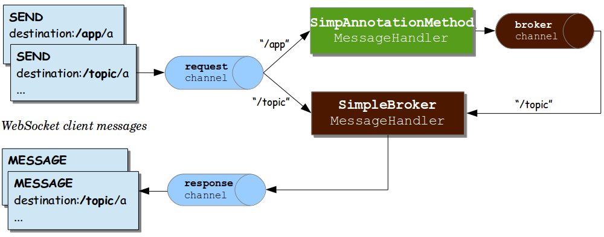

# STOMP
## work flow
```java
@Configuration
@EnableWebSocketMessageBroker
@RequiredArgsConstructor
public class WebSocketConfig implements WebSocketMessageBrokerConfigurer {

    @Value("${origins}")
    private String origins;

    @Override
    public void registerStompEndpoints(StompEndpointRegistry registry) {
        // SockJS을 연결할 endpoint url
        registry.addEndpoint("/stomp")
                .setAllowedOrigins(origins)
                .withSockJS();
    }

    @Override
    public void configureMessageBroker(MessageBrokerRegistry registry) {
        // 클라이언트가 메세지를 보낼 때의 url prefix
        registry.setApplicationDestinationPrefixes("/chat")
        // 클라이언트가 subscribe 할 때 붙는 url prefix
        // 메세지 브로커는 url처럼 이름이 붙는데 메세지 브로커 이름이 subs라 보면 된다.
                .enableSimpleBroker("/subs");
    }
}
```
* WebSocketMessageBrokerConfigurer를 구현하여 STOMP를 사용할 수 있는데 registerStompEndpoints()의 addEndpoint()를 통해 어느 url로 SockJS를 연결할 지 정하고, configureMessageBroker()의 setApplicationDestinationPrefixes()를 통해 클라이언트가 메세지를 보낼 때의 url prefix와 enableSimpleBroker()를 통해 메세지 브로커의 이름을 정한다.
```java
@Controller
public class ChatController {

    // topic
    @MessageMapping("/room")
    // /subs 메세지 브로커에 room 토픽으로 메세지를 내림
    // 메세지가 들어올 때는 /chat/room으로 들어오지만 메세지 브로커에는 /subs/room으로 메세지를 내린다.(정확히는 브로커 채널에)
    @SendTo("/subs/room")
    public String message(String msg) {
        return msg;
    }
}
```
```typescript
import { useEffect, useRef, useState } from "react";
import SockJS from "sockjs-client";
import Stomp from "stompjs";

function ChatForm() {
    const stomp = useRef<Stomp.Client>();
    const [receivedMsg, setReceivedMsg] = useState<string[]>([]);
    const [msg, setMsg] = useState("");
    useEffect(() => {
        const ws = new SockJS("http://localhost:8080/stomp");
        stomp.current = Stomp.over(ws);
        stomp.current.connect({}, () => {
            // /subs/ 브로커의 room 토픽을 susbscribe
            stomp.current?.subscribe("/subs/room", (message) => {
                setReceivedMsg(receivedMsg => [message.body, ...receivedMsg]);
            });
        });
        return () => {
            stomp.current?.disconnect(() => {});
        }
    }, []);
    const onSubmit = (event: React.FormEvent<HTMLFormElement>) => {
        event.preventDefault();
        // 메세지는 /chat/room 으로 보낸다.
        stomp.current?.send("/chat/room", {}, msg);
        setMsg("");
    }
    const onChange = (event: React.ChangeEvent<HTMLInputElement>) => {
        setMsg(event.target.value);
    }

    return (
        <div>
            <ul>
                {receivedMsg.map((msg, idx) => <li key={idx}>{msg}</li>)}
            </ul>
            <form onSubmit={onSubmit}>
                <input type="text" placeholder='메세지 입력' onChange={onChange} value={msg} required/>
                <button>보내기</button>
            </form>
        </div>
    );
}

export default ChatForm;
```


> SimpleBroker 사용 시 work flow


> 외부 메세지 브로커 사용 시 work flow

1. 클라이언트는 서버와 SockJS연결을 한다.
2. 연결이 완료되면 클라이언트는 서버에게 원하는 topic에 대한 subscribe frame을 보내서 해당 토픽에 대한 subscribe를 한다.
3. 클라이언트는 특정 topic에 대한 메세지를 보낸다.
4. 서버에서는 해당 topic을 처리하는 메세지 핸들러가 해당 메세지를 받아 ApplicationDestinationPrefix를 메세지 브로커의 이름으로 바꾼 후 브로커 채널에 내려보낸다.
5. 해당 이름을 가진 메세지 브로커가 topic을 subscribe 하고있는 클라이언트에게 응답을 보낸다.