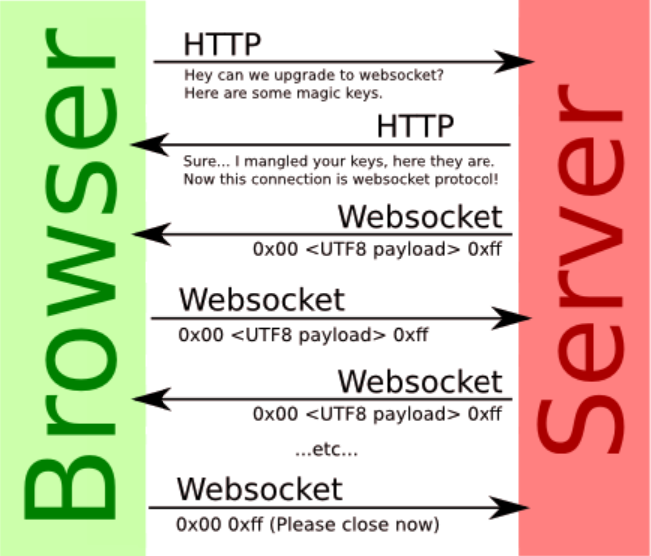

# 웹 소켓
## WebSocket


```typescript
// 클라이언트
import { useEffect, useRef, useState } from "react";

function ChatForm() {
    const ws = useRef<WebSocket>();
    const [receiveMsg, setReceiveMsg] = useState<string[]>([]);
    useEffect(() => {
        ws.current = new WebSocket("ws://localhost:8080/chat");
        ws.current.onopen = () => {
            console.log("웹소켓 연결");
        };
        ws.current.onmessage = (message) => {
            setReceiveMsg(receiveMsg => [message.data, ...receiveMsg]);
        };
        ws.current.onclose = () => {
            console.log("웹소켓 연결 해제");
        };
        return () => {
            ws.current?.close();
        }
    }, []);  
    const [msg, setMsg] = useState("");
    const onSubmit = (event: React.FormEvent<HTMLFormElement>) => {
        event.preventDefault();
        ws.current?.send(msg)
        setMsg("");
    }
    const onChange = (event: React.ChangeEvent<HTMLInputElement>) => {
        setMsg(event.target.value);
    }

    return (
        <div>
            <ul>
                {receiveMsg.map((msg, idx) => <li key={idx}>{msg}</li>)}
            </ul>
            <form onSubmit={onSubmit}>
                <input type="text" placeholder='메세지 입력' onChange={onChange} value={msg} required/>
                <button>보내기</button>
            </form>
        </div>
    );
}

export default ChatForm;
```
```java
//영상일 때는 BinaryWebSocketHandler를 상속하면 된다.
@Component
@Slf4j
public class ChatWebSocketHandler extends TextWebSocketHandler {

    private static List<WebSocketSession> clients = new ArrayList<>();

    // 메세지 수신 시 동작
    @Override
    protected void handleTextMessage(WebSocketSession session, TextMessage message) throws Exception {

        log.info("payload : {}", message.getPayload());
        for (WebSocketSession client : clients) {
            client.sendMessage(message);
        }
    }

    // 클라이언트 웹소켓 연결 시 동작
    @Override
    public void afterConnectionEstablished(WebSocketSession session) throws Exception {
        log.info("클라이언트 접속 : {}", session);
        clients.add(session);
    }

    // 클라이언트 웹소켓 연결 끊어지면 동작
    @Override
    public void afterConnectionClosed(WebSocketSession session, CloseStatus status) throws Exception {
        log.info("클라이언트 접속 해제 : {}", session);
        clients.remove(session);
    }
}
```
```java
@Configuration
@EnableWebSocket
@RequiredArgsConstructor
public class WebSocketConfig implements WebSocketConfigurer {

    private final ChatWebSocketHandler chatWebSocketHandler;

    @Value("${origins}")
    private String origins;

    // 웹 소켓이 어떻게 동작할지 로직을 정하는 핸들러를 등록한다.
    @Override
    public void registerWebSocketHandlers(WebSocketHandlerRegistry registry) {
        registry.addHandler(chatWebSocketHandler, "chat")
                .setAllowedOrigins(origins);
    }
}
```
* WebSocket은 웹 표준이기 때문에 안정적으로 사용할 수 있고, 브라우저가 기본적으로 내장하고 있기 때문에 별다른 다운로드 없이 바로 사용할 수 있다.
* IE8 이하에서는 webSocket을 내장하고 있지 않기 때문에 WebSocket을 사용할 수 없다. 만약 모든 브라우저 상에서 동작하도록 하고 싶으면 socket.io 나 SockJS를 사용해야한다.
## SockJS
```typescript
import { useEffect, useRef, useState } from "react";
import SockJS from "sockjs-client";

function ChatForm() {
    const ws = useRef<any>();    
    const [receivedMsg, setReceivedMsg] = useState<string[]>([]);
    useEffect(() => {
        ws.current = new SockJS("http://localhost:8080/chat");
        ws.current.onopen = () => {
            console.log("웹소켓 연결");
        };
        ws.current.onmessage = (message: any) => {
            setReceivedMsg(receiveMsg => [message.data, ...receiveMsg]);
        };
        ws.current.onclose = () => {
            console.log("웹소켓 연결 해제");
        };
        return () => {
            ws.current?.close();
        }
    }, []);  
    const [msg, setMsg] = useState("");
    const onSubmit = (event: React.FormEvent<HTMLFormElement>) => {
        event.preventDefault();
        ws.current?.send(msg)
        setMsg("");
    }
    const onChange = (event: React.ChangeEvent<HTMLInputElement>) => {
        setMsg(event.target.value);
    }

    return (
        <div>
            <ul>
                {receivedMsg.map((msg, idx) => <li key={idx}>{msg}</li>)}
            </ul>
            <form onSubmit={onSubmit}>
                <input type="text" placeholder='메세지 입력' onChange={onChange} value={msg} required/>
                <button>보내기</button>
            </form>
        </div>
    );
}

export default ChatForm;
```
```java
@Configuration
@EnableWebSocket
@RequiredArgsConstructor
public class WebSocketConfig implements WebSocketConfigurer {

    private final ChatWebSocketHandler chatWebSocketHandler;

    @Value("${origins}")
    private String origins;

    @Override
    public void registerWebSocketHandlers(WebSocketHandlerRegistry registry) {
        registry.addHandler(chatWebSocketHandler, "chat")
                .setAllowedOrigins(origins)
                .withSockJS();
    }
}
```
* 웹소켓을 다룰 때와 거의 다르지 않다. 다른 점은 클라이언트에서 웹소켓 대신 SockJS를 사용하고 서버에서도 `.withSockJS()`를 통해 SockJS를 사용하도록 설정했다는 것이다.(핸들러의 로직은 완전히 같다.)
* 웹소켓과의 차이점은 SockJS는 웹소켓을 기본적으로 사용하고 웹소켓 연결이 불가능할 시에는 스트리밍이나 폴링 방식을 통해 연결을 시도한다. 따라서 IE8버전 이하의 브라우저에서도 사용이 가능하지만 SockJS를 사용하기위해 클라이언트 측에서는 별도로 패키지를 다운로드 받아야한다.